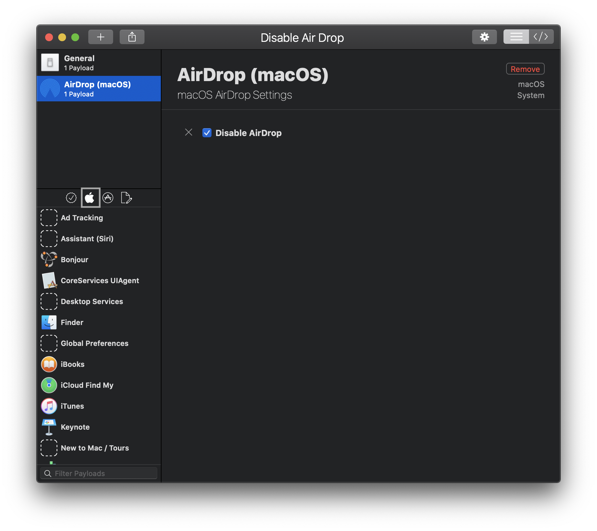

# Custom Configuration Profiles in JumpCloud

JumpCloud supports the management of Custom MDM Configuration [profiles](https://developer.apple.com/documentation/devicemanagement/using_configuration_profiles?language=objc) through [Custom MDM Profiles](https://jumpcloud.com/blog/custom-configuration-profiles). Tools like [ProfileCreator](https://github.com/ProfileCreator/ProfileCreator), [imazing Profile Editor](https://imazing.com/profile-editor/download) or [Apple Configurator 2](https://apps.apple.com/us/app/apple-configurator-2/id1037126344?mt=12) can be used to generate .mobileconfig files which contain preferences for systems and macOS applications.

## Table of Contents

- [Custom Configuration Profiles in JumpCloud](#custom-configuration-profiles-in-jumpcloud)
  - [Table of Contents](#table-of-contents)
  - [General settings for ProfileCreator](#general-settings-for-profilecreator)
  - [Configuration Profile Examples](#configuration-profile-examples)
    - [Catalina Notifications Profile](#catalina-notifications-profile)
    - [Firefox Custom Profile](#firefox-custom-profile)
    - [Chrome Custom Profile](#chrome-custom-profile)
    - [Custom Dock Profile](#custom-dock-profile)
    - [Custom Font Distribution](#custom-font-distribution)
    - [Disable Airdrop](#disable-airdrop)
  - [Export a profile](#export-a-profile)
  - [Other Considerations](#other-considerations)
    - [Removal of profiles](#removal-of-profiles)

## General settings for ProfileCreator

The ProfileCreator application has a well-documented [wiki](https://github.com/ProfileCreator/ProfileCreator/wiki). Consult the wiki for ProfileCreator specific issues or join the conversion over in the #profilecreator channel in the [MacAdmins Slack](https://www.macadmins.org/) for additional help.

When opening ProfileCreator for the first time, it's advised to set organizational identifiers. Profiles exported with ProfileCreator are identified with the organizational identifiers set under ProfileCreator > Preferences > Profile Defaults:


Consider setting an organization name and identifier.

#TODO: profiles distributed to systems via the JumpCloud Custom MDM profile or commands will display the an organizational identifier.

## Configuration Profile Examples

The following section demonstrates the process to create several example custom configuration profiles. The following examples should be used as a reference and tested prior to deployment.

- Catalina Notifications
- Firefox Settings
- Custom Dock Configuration
- Custom Font Distribution

### Catalina Notifications Profile

As of the release of macOS Catalina 10.15 users are prompted to allow or deny specific applications from prompting notification banners. This custom policy can be used to set the allow or deny preference on a per application basis.

This specific profile will allow the JumpCloud tray application to send the user notifications.

To create a new profile, open ProfileCreator and click the [ + ] icon.


Select a name for the policy, add a description and change the organization name if the settings were not applied by default. Depending on the policy scope, a profile can be applied at the System or User level. In this example the notification payload is a System level payload.


Scroll down the left column profile template window, under macOS select the Notifications Payload, add the payload and add the notification settings preference so that the window is editable like the example below. Profiles selected as part of the profile payload are listed in top left column under the General tab.


In order to add applications to the payload the "App Bundle Identifier" name is required. There are several methods for identifying an applications "App Bundle Identifier". A quick way to identify an given "App Bundle Identifier" is to run the following command, substituting "Microsoft Excel" for the name of an application as it exists in a systems /Applications window.

```bash
osascript -e 'id of app "Microsoft Excel"'
```


The result of that command run against the JumpCloud application is: `com.jumpcloud.jcagent-tray`. Copy that value into the "App Bundle Identifier" for the Notification payload preference. In the example image below the `com.apple.iCal` notification settings are also applied. Note the difference between "Alert Types" between the two preferences. Refer to Apple's documentation on [alert types](https://developer.apple.com/design/human-interface-guidelines/macos/system-capabilities/notifications/) for more information.


Save and [Export](#export-a-profile) the profile for deployment. Distribute to JumpCloud systems through [Custom MDM profiles](https://jumpcloud.com/blog/custom-configuration-profiles).

### Firefox Custom Profile

Firefox or other browsers can be configured to accept settings from a profile. To create an application manifest payload. Select the application icon and add the Firefox profile. Ensure the EnterprisePoliciesEnabled checkbox is ticked like the example below:


Add a setting like default homepage like the example below. Save and [export the policy](#export-a-profile).


Save and [Export](#export-a-profile) the profile for deployment. Distribute to JumpCloud systems through [Custom MDM profiles](https://jumpcloud.com/blog/custom-configuration-profiles)

### Chrome Custom Profile

Chrome settings and other browser settings can be managed through a custom configuration profile. The Chrome profile in this example will silently install extensions. To create an application manifest payload. Select the application icon in ProfileCreator and add the Chrome profile. Under the 'Extensions' settings, scroll to the "Extension/App IDs and update URLs to be silently installed:

Each Chrome Extension has a unique ID, when entered in this payload, Chrome will silently reference that ID and install that Extension on a systems Chrome Browser.

To find a Chrome Extension's unique ID, visit the [Chrome Extension Web Store](https://chrome.google.com/webstore/category/extensions?hl=en) search for a desired extension and take note of the unique ID in the extensions URL - this ID value can be entered in the Chrome extension profile to silently install Extensions on systems. The highlighted value in the photo below is the unique ID for the ublock origin extension.


Unique ID's from several extensions can be populated in the same payload like the example below:


### Custom Dock Profile

An admin can configure a custom dock payload for their systems using ProfileCreator. The example payload below demonstrates a configuration to add Chess, Calendar and Terminal to the users dock. (Note. This configuration will only work with Catalina systems since only Catalina OS has system applications Stored under the `/System/Applications/` path)

This example sets the dock pixel size to 24px and positions the dock on the left side of the screen.


Save and [Export](#export-a-profile) the profile for deployment. Distribute to JumpCloud systems through [Custom MDM profiles](https://jumpcloud.com/blog/custom-configuration-profiles)

### Custom Font Distribution

Individual Fonts or Font Families can be distributed through custom profiles. The Payload example below contains four Font Payloads. Clicking the [+] icon next to payload allows a user to add additional payloads to the profile. In the example below, [Google's Roboto Mono for Powerline](https://github.com/powerline/fonts/tree/master/RobotoMono) font is being distributed along with the Bold, Medium and Light font variants in the other payloads.


(note: Font payloads must be under 1MB to comply with the JumpCloud command file size limit)

Save and [Export](#export-a-profile) the profile for deployment. Distribute to JumpCloud systems through [Custom MDM profiles](https://jumpcloud.com/blog/custom-configuration-profiles).

### Disable Airdrop

A profile to disable AirDrop can be distributed as a custom profile. The Payload example below contains a single Payload to disable AirDrop. Click the Apple Icon and add the AirDrop (macOS) Payload to a profile. Click the Disable AirDrop checkbox to ensure AirDrop is disabled on systems with this profile. Systems must be restarted for the profile to apply.



Save and [Export](#export-a-profile) the profile for deployment. Distribute to JumpCloud systems through [Custom MDM profiles](https://jumpcloud.com/blog/custom-configuration-profiles).

## Export a profile

Assuming a profile is ready for deployment. Save and Export the profile using the ProfileCreator file menu. File > Export...

On the export menu, choose a location to save the profile. The profile will be uploaded and sent to systems with JumpCloud's Custom MDM Configuration Profile.


## Other Considerations

### Removal of profiles

To remove a profile distributed with [Custom MDM profile](https://jumpcloud.com/blog/custom-configuration-profiles), remove the system from the scope of the policy. The profile will immediately be removed from the target system.

To identify a profile already installed on a macOS system, run the `sudo profiles -P` command to view all profiles currently installed on a system.

