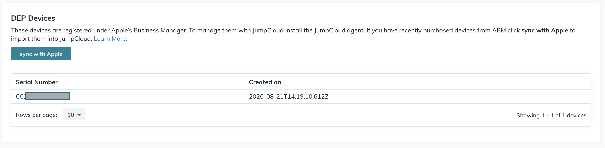
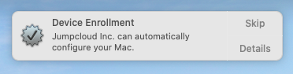
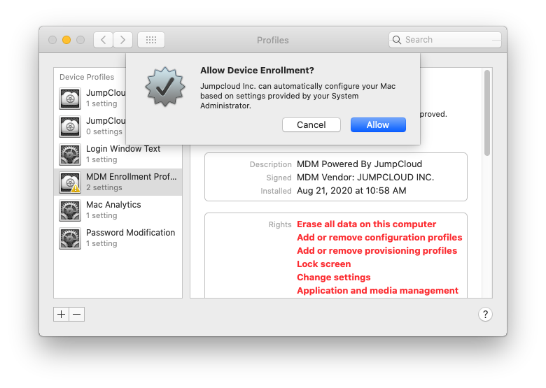
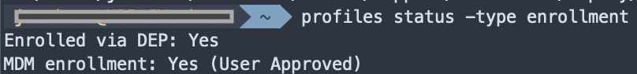

#### Name

Mac - Enroll MDM System in DEP | v1.1 JCCG

#### commandType

mac

#### Command

```
#!/bin/bash

# Verify JumpCloud MDM
verify_jc_mdm (){
    # Check the system for the following profileIdentifier
    mdmID="com.jumpcloud.mdm"
    check=$(profiles -Lv | grep "name: $4" -4 | awk -F": " '/attribute: profileIdentifier/{print $NF}')
    if [[ $check == *$mdmID* ]] ; then
        echo "ProfileIdentifier: ${mdmID} found on system. MDM Verified"
        return
    else
        echo "JumpCloud MDM profile not found on system."
        false
    fi
}

# If JumpCLoud MDM is on the system check for DEP Enrollment
if verify_jc_mdm "$":; then
    depApproveCheck=$(profiles status -type enrollment | grep "Enrolled via DEP:" | awk 'NF>1{print $NF}')
    if [[ $depApproveCheck = "No" ]]; then
        echo "MDM is not DEP enrolled, enrolling and prompted for User Approval"
        # Prompt for DEP Enrollment
        profiles renew -type enrollment
        exit 0
    elif [[ $depApproveCheck = "Yes)" ]]; then
        echo "MDM is DEP enrolled already"
        exit 0
    fi
else
    exit 1
fi
```

#### Description

**Note** Before using this command, a [JumpCloud tenant must first be configured with Apple Business Manager](https://jumpcloud.com/blog/integrate-apple-business-manager) or Apple School Manager. Devices must then be added to your MDM server by serial number or Apple Order ID through Apple Business Manager or Apple School Manager. Devices with matching Serial numbers will be displayed in a JumpCloud Tenant under "DEP Devices"



This command will enroll a system with the JumpCloud MDM, in DEP. If the system is not enrolled in DEP, the active user of the system will be prompted to approve the MDM profile.



If the user clicks the notification window, they'll be brought to the Profiles System Preference panel and prompted to Allow Device Enrollment.



If the user clicks allow the device will be DEP enrolled and the MDM profile will become non-removable.



#### *Import This Command*

To import this command into your JumpCloud tenant run the below command using the [JumpCloud PowerShell Module](https://github.com/TheJumpCloud/support/wiki/Installing-the-JumpCloud-PowerShell-Module)

```
Import-JCCommand -URL 'https://git.io/JUIqN'
```
