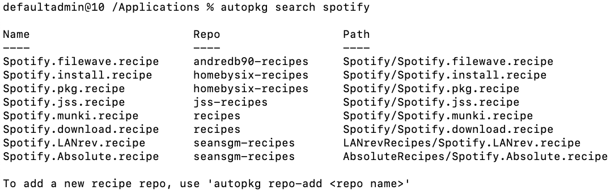

# Update/ Patching using JumpCloud

There are a few methods for patching mac systems. [AutoPkg](https://github.com/autopkg/autopkg) is a well supported, community backed project which uses "recipe" based code to process package installs and deployment. [Homebrew](https://brew.sh/) is another popular package manager for macOS. Either tool can be used in conjunction with JumpCloud to push and update packages on macOS systems. The scripts provided in this repository and within each package manager should be vetted by each admin before use in a production environment.

Prerequisites: Install Xcode command line tools (recommended for git). Install via a JumpCloud Command. [Rich Trouton's silent Xcode install script](https://github.com/rtrouton/rtrouton_scripts/tree/master/rtrouton_scripts/install_xcode_command_line_tools) is a valid way to do this. Add as a new command with a 5-10min timeout depending on network speed.

## AutoPKG

Although AutoPkg is commonly used to source packages for deployment en masse, it has the ability to install packages locally. Many members in the Mac Admin community have built their own [AutoPkg repositories](https://github.com/autopkg) of software packages and published those on github. AutoPkg is typically used with various processors to upload compiled packages directly to Munki, Jamf Pro, Filewave or other distribution points.

AutoPkg can be installed locally on systems and directed to install ".download" recipes. Included within AutoPkg are several core processors which admins can leverage to take various action on package sources. The ".install" recipe extension takes the output of a .download recipe and installs it on a local system. The AutoPkg recipe system is very modular. An admin can build their own "exampleApplication.install" recipe based on "macAdminCommunityMember's-exampleApplication.download" recipe. Thus, an admin can install any community built recipe on local machines. Similarly, the .jss and .munki extensions build upon .download recipes to take additional action like uploading packages to Jamf Distribution points, creating smart groups and automating the package deployment process.

The recipe system of AutoPkg allows admins to have granular control of their packaging workflow. Without much configuration, AutoPkg can be used to install packages. Advanced workflows could be developed to check sources for viruses and distribute packages to testing endpoints before general distribution. In this example, we'll leverage AutoPkg's ability to source and install packages on a local system.

Requirements:

* Admin user across all systems
* Xcode Command Line Tools installed for the management of .git sources
* At least one repository to search, download and install applications

Deploy the [Mac - Install AutoPkg Package Manager](./Mac&#32;-&#32;Install&#32;AutoPkg&#32;Package&#32;Manager.md) command to your desires system endpoints.

### Deployment of Chrome, Firefox and VLC with AutoPKG Example

The [Mac - Install AutoPkg Apps](Mac&#32;-&#32;Install&#32;Homebrew&#32;Apps.md) command is included to provide admins with a one click example script to deploy Chrome, Firefox and VLC player.

### Updating AutoPkg Managed Applications

Well-Maintained AutoPkg recipes point to the latest version of an application unless otherwise specified. Running `autopkg install firefox.install` on a system with Firefox installed will compare versions the installed application and the downloaded application and evaluate whether or not an update is necessary. If the AutoPkg source application is greater than the installed version on a given system, AutoPkg will attempt to install over the existing version of an application.

If a specific version of an Application is required, chances are that AutoPkg can download an install that package. Rich Trouton's Der Flounder blog posted a short  article on [AutoPkg's ability to package versioned apps](https://derflounder.wordpress.com/2013/11/10/using-autopkg-to-download-and-create-installers-for-firefox/).

### Example deployment of Spotify and adding a new repository

After installing AutoPkg on a system, the autopkg binary should have been made available in your system path. Running the command: `autopkg --help` with produce help documentation on a per-verb basis.

On a system with AutoPkg installed, run: `autopkg search spotify`.



The result .recipe files in the example above are results pulled from the community built [AutoPkg github](https://github.com/autopkg) organization. The "Spotify.download.recipe" in the "recipes" repo is the base recipe we'll use to install Spotify on our example machine. [Elliot Jordan's homebysix-recipes repo](https://github.com/homebysix) contains a Spotify.install.recipe which we can use to install Spotify on our systems. If both repositories are trusted, and the contents of each recipe have been vetted, add both repositories using the `autopkg repo-add` command to add the repositories by their respective urls.

For example:

```bash
autopkg repo-add https://github.com/autopkg/recipes
autopkg repo-add https://github.com/autopkg/homebysix-recipes
```

Both recipe repositories should be available for the user context. Running `autopkg repo-list` should display the currently installed recipe repositories. After adding both repositories the .recipe file is available for the autopkg binary. Run `AutoPkg info Spotify.install` to verify information about the recipe before executing the run command:

```bash
autopkg run Spotify.install
```

Spotify should be installed on the current system. JumpCloud commands can automate this process across multiple systems.

## Homebrew

Like AutoPkg, Homebrew enables users to build their own "Formulas" and package their own apps. Homebrew enables users to install unix applications on their macOS systems. It was extended later to install native macOS apps. Although Homebrew can be installed in multiple locations for multiple users, the script to install Homebrew using JumpCloud commands leverages a single administrator account.

Requirements:

* Admin user across all systems
* Xcode Command Line Tools installed for the management of .git sources

Deploy the [Mac - Install Homebrew Package Manager](./Mac&#32;-&#32;Install&#32;Homebrew&#32;Package&#32;Manager.md) command to your desired system endpoints.

### Deployment of Chrome, Firefox and VLC with Homebrew Example

The included [Mac - Install Homebrew Package Manager](./Mac&#32;-&#32;Install&#32;Homebrew&#32;Package&#32;Manager.md) command installs homebrew and sets permissions for a default admin to administer the installation of packages. The script assumes the eventual installation of [cask application installations](https://github.com/Homebrew/homebrew-cask) and preemptively creates the required directories required to do so.

Subsequent application installs can be called as such:

```bash
/usr/local/bin/brew install wget
/usr/local/bin/brew cask install firefox
```

Using JumpCloud commands, the brew binary is invoked as a default admin user without changing. Scripts deployed to install apps are required to be run as the default admin user account which was used in the [Mac - Install Homebrew Package Manager](./Mac&#32;-&#32;Install&#32;Homebrew&#32;Package&#32;Manager.md) command. An example [Mac - Install Homebrew Apps](./Mac&#32;-&#32;Install&#32;Homebrew&#32;Apps.md) command is included to show the context in which an admin could administer the installation of Chrome, Firefox and VLC.

### Deployment 
