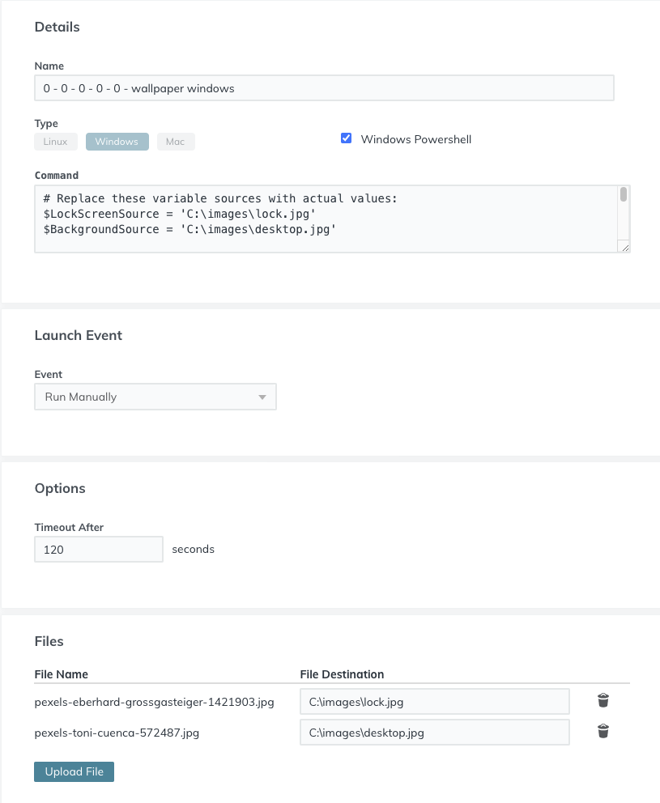

#### Name

Windows - Change Lock Screen & Desktop Background | v1.0 JCCG

#### commandType

windows

#### Command

```
# Replace these variable sources with actual values:
$LockScreenSource = 'C:\pathToImages\lockImage.jpg'
$BackgroundSource = 'C:\pathToImages\backgroundImage.jpg'

Function Update-LockAndBackgroundScreen{
    Param(
            [Parameter(Mandatory=$false,Position=0)]
            [ValidateNotNullOrEmpty()]
            [string]$LockScreenSource,
            [Parameter(Mandatory=$false,Position=1)]
            [ValidateNotNullOrEmpty()]
            [string]$BackgroundSource
    )
    Begin {
        $ErrorActionPreference = "Stop"
        $RegKeyPath = "HKLM:\SOFTWARE\Microsoft\Windows\CurrentVersion\PersonalizationCSP"
        $DesktopPath = "DesktopImagePath"
        $DesktopStatus = "DesktopImageStatus"
        $DesktopUrl = "DesktopImageUrl"
        $LockScreenPath = "LockScreenImagePath"
        $LockScreenStatus = "LockScreenImageStatus"
        $LockScreenUrl = "LockScreenImageUrl"
        $StatusValue = "1"
        $DesktopImageValue = "C:\Windows\System32\Desktop.jpg"
        $LockScreenImageValue = "C:\Windows\System32\LockScreen.jpg"
    }
    process{
        if (!$LockScreenSource -and !$BackgroundSource)
        {
            Write-Host "Either LockScreenSource or BackgroundSource must has a value."
        }
        else
        {
            if(!(Test-Path $RegKeyPath)) {
                Write-Host "Creating registry path $($RegKeyPath)."
                New-Item -Path $RegKeyPath -Force | Out-Null
            }
            if ($LockScreenSource) {
                Write-Host "Copy Lock Screen image from $($LockScreenSource) to $($LockScreenImageValue)."
                Copy-Item $LockScreenSource $LockScreenImageValue -Force
                Write-Host "Creating registry entries for Lock Screen"
                New-ItemProperty -Path $RegKeyPath -Name $LockScreenStatus -Value $StatusValue -PropertyType DWORD -Force | Out-Null
                New-ItemProperty -Path $RegKeyPath -Name $LockScreenPath -Value $LockScreenImageValue -PropertyType STRING -Force | Out-Null
                New-ItemProperty -Path $RegKeyPath -Name $LockScreenUrl -Value $LockScreenImageValue -PropertyType STRING -Force | Out-Null
            }
            if ($BackgroundSource) {
                Write-Host "Copy Desktop Background image from $($BackgroundSource) to $($DesktopImageValue)."
                Copy-Item $BackgroundSource $DesktopImageValue -Force
                Write-Host "Creating registry entries for Desktop Background"
                New-ItemProperty -Path $RegKeyPath -Name $DesktopStatus -Value $StatusValue -PropertyType DWORD -Force | Out-Null
                New-ItemProperty -Path $RegKeyPath -Name $DesktopPath -Value $DesktopImageValue -PropertyType STRING -Force | Out-Null
                New-ItemProperty -Path $RegKeyPath -Name $DesktopUrl -Value $DesktopImageValue -PropertyType STRING -Force | Out-Null
            }
            rundll32.exe user32.dll, UpdatePerUserSystemParameters
        }
    }
}


Update-LockAndBackgroundScreen -LockScreenSource $LockScreenSource -BackgroundSource $BackgroundSource
```

#### Description

Change Lock Screen and Desktop Background in Windows 10 Pro. This script allows you to change logon screen and desktop background in Windows 10 Professional using GPO startup script. The Update-LockAndBackgroundScreen function takes two parameter sources, LockScreenSource & BackgroundSource. One or both parameters may be used to update the lock and desktop background. This script was modified from author: Juan Granados and originally posted at: https://gallery.technet.microsoft.com/scriptcenter/Change-Lock-Screen-and-245b63a0#content

This command can be used in conjunction with files uploaded directly to JumpCloud. Both the lock screen and desktop background images can be uploaded to systems as long as the file destination folder exists on the target system. In the example below the target system contained an 'images' directory in C:\ prior to running the command.



#### *Import This Command*

To import this command into your JumpCloud tenant run the below command using the [JumpCloud PowerShell Module](https://github.com/TheJumpCloud/support/wiki/Installing-the-JumpCloud-PowerShell-Module)

```
Import-JCCommand -URL 'https://git.io/REPLACEME'
```
