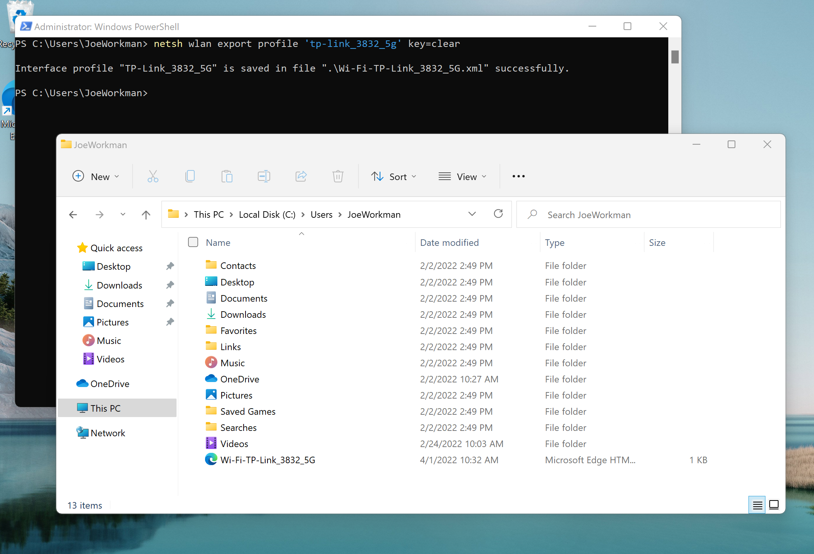
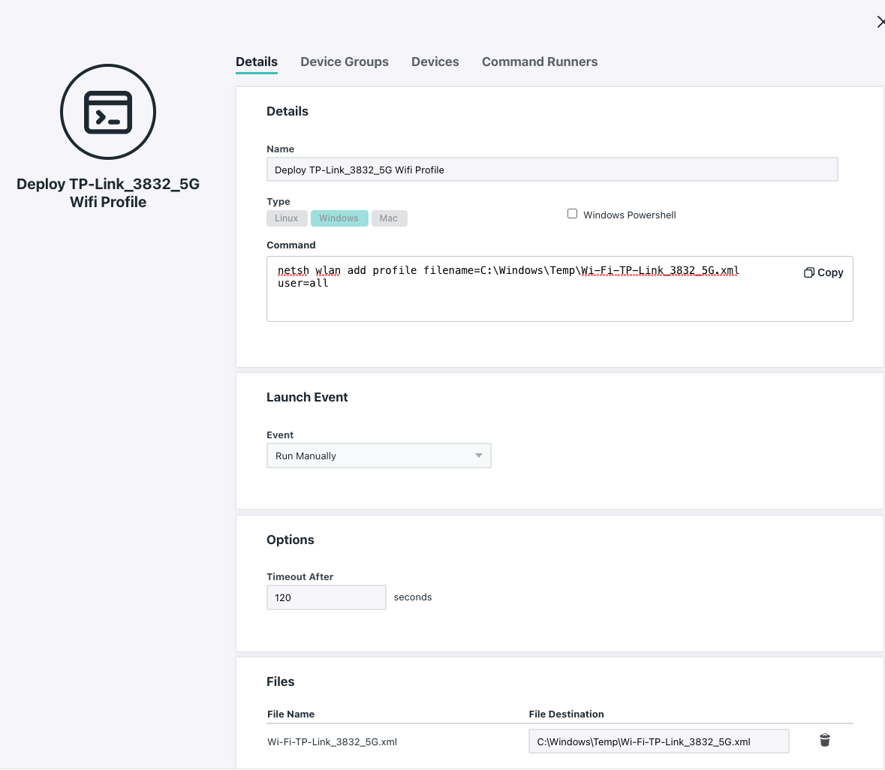

On multiple occasions, the ability for JumpCloud to deploy WiFi network profiles via policies has been requested. Once JumpCloud supports user level profiling via policies, that feature request should be feasible. In the interim period, this blog post will detail how to copy a network profile from an existing system and deploy it to others via JumpCloud Commands. This example only demonstrates how to export and apply a plaintext password profile. This solution may not meet every use case. Please submit a [feature request](https://support.jumpcloud.com/support/s/article/to-submit-a-jumpcloud-feature-request2) if this solution does not meet immediate needs

### Overview

The steps to accomplish this task are outlined below

* Export a profile from a physical Windows device
* Clean/ Prune the generated profile
* Create a JumpCloud command with the profile as a payload
* Deploy the profile to systems via JumpCloud

#### Export a profile

To export a profile from an existing windows device. First ensure that device is connected the wireless network you wish to export.

Open a PowerShell session as an Administrator. Change directories to a location you can easily access and type:

```powershell
netsh wlan export profile "NameOfWifiNetwork" key=clear
```

This command will export an .XML file in the current working directory titled "WIFI-NameOfWifiNetwork"



### Clean/ Modify the XML as necessary

Depending on the desired configuration you may need to modify the XML profile before using it in a JumpCloud command. For more details, please refer to Microsoft documentation on [Wireless Profile Samples](https://docs.microsoft.com/en-us/windows/win32/nativewifi/wireless-profile-samples) and [valid XML profile configurations](https://docs.microsoft.com/en-us/windows/win32/nativewifi/wlan-profileschema-wlanprofile-element)

### Create a JumpCloud Command with the profile as a payload

Create a command in the JumpCloud console. Add the XML file from the first step to the files payload of the command. Add the following to the command execution block:

```powershell
netsh wlan add profile filename=C:\Windows\Temp\Wi-Fi-TP-Link_3832_5G.xml user=all
```

**Note** in the example above and below the XML file is titled "Wi-Fi-TP-Link_3832_5G.xml" the file generated in step one will almost certainly be different.



#### Deploy the profile to systems via JumpCloud

Assign a device group or individual devices to the command created above and deploy the command to systems in an organization. Once installed, systems will have access to that network profile.
