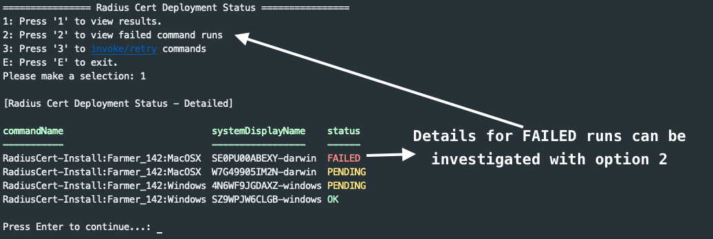

# Generate Radius Certificates for users

This set of PowerShell automations are designed to help administrators generate user certificates for [passwordless Radius Server Authentication](https://support.jumpcloud.com/support/s/article/configuring-radius-servers-in-jumpcloud1).

## Requirements

This automation has been tested with OpenSSL 3.1.1. OpenSSL 3.x.x is required to generate the Radius Authentication user certificates. The following items are required to use this automation workflow

- PowerShell 7.x.x ([PowerShell 7](https://learn.microsoft.com/en-us/powershell/scripting/install/installing-powershell?view=powershell-7.3))

- OpenSSL 3.x.x (Tested with 3.1.1) (see macOS/ Windows requirements below)
- [JumpCloud PowerShell Module](https://www.powershellgallery.com/packages/JumpCloud)
- [JumpCloud Radius Module](https://www.powershellgallery.com/packages/JumpCloud.Radius)
- Certificate Authority (CA) (either from a vendor or self-generated using the JumpCloud.Radius module)
- Module Settings Configured with `Set-JCRConfig` cmdlet
- JumpCloud Organization API Key (Read/ Write Access Required)
  - JumpCloud API Key Set (Read/ Write Access Required)
  - JumpCloud ORG ID Set
  - JumpCloud User Group containing users and assigned to a Radius Server

### macOS Requirements

macOS ships with a version of OpenSSL titled LibreSSL. LibreSSL is sufficient to generate the `usernameCN` and `emailDN` type certificates but not the `emailSAN` type certificate (due to the inclusion of x509 subject headers in the certificate body). As such, a distribution of OpenSSL 3.x.x is required to run these scripts. While running the application, you'll be prompted to locate Openssl 3.x.x if it is not found.

To install the latest version of OpenSSL on mac, install the [Homebrew package manager](https://brew.sh/) and install the following [formulae](https://formulae.brew.sh/formula/openssl@3)

Some packages or applications in macOS rely on the pre-configured LibreSSL distribution. To use the Homebrew distribution of OpenSSL in this project, simply change the `openSSLBinary` setting with `Set-JCRConfig` to point to the Homebrew bin location ex:

Update the `openSSLBinary` to point to `'/usr/local/Cellar/openssl@3/3.1.1/bin/openssl'`.

ex:

```powershell
Set-JCRConfig -openSSLBinary '/opt/homebrew/opt/openssl@3/bin/openssl'
```

### Windows Requirements

Windows does not typically ship with a preconfigured version of OpenSSL but a pre-compiled version of OpenSSL can be installed from [Shining Light Productions](https://slproweb.com/products/Win32OpenSSL.html). These automations have been tested with the full installer (i.e. not the "Light") version of the tool. OpenSSL can of course be downloaded and configured from [source](https://www.openssl.org/source) if desired.

If the pre-compiled version of OpenSSL was installed, the OpenSSL should be installed in `C:\Program Files\OpenSSL-Win64\bin\`. There should exist an `openssl.exe` binary in that directory. In addition, there should also exist a `legacy.dll` file in that same directory which is required if generating `$emailSAN` user certificates.

To set the required system environment variables for this automation

- Open Control Panel
- Select "Edit the system environment variables"
- under the "System Properties" window and "Advanced" tab, select the "Environment Variables..." box
- Under the "User Variables for yourAccount" Click the "New..." box
  - Set the Variable Name to: `OPENSSL_MODULES`
  - Set the Variable Value to: `C:\Program Files\OpenSSL-Win64\bin` or the location of the `legacy.dll` file included in your OpenSSL distribution
  - Click "OK"
- Under the "System variables" section scroll down to the "Path" variable, select it and click "Edit..."
  - Add a new line entry for this variable and type `C:\Program Files\OpenSSL-Win64\bin` or the location of the `openssl.exe` file included in your OpenSSL distribution
  - Click "OK"
- Click "OK" to close and save the Environment Variables dialog box
- Click "OK to close and save the System Properties dialog box

The `openssl` command should be available in new PowerShell terminal windows.

## Setup

Ensure that you are these commands in a PowerShell 7 environment. Within your PowerShell terminal window run `$PSVersionTable`, PSVersion should be version 7.x.x. If 5.1.x is running you need to install [PowerShell 7 from Microsoft](https://learn.microsoft.com/en-us/powershell/scripting/install/installing-powershell?view=powershell-7.3)

After installing PowerShell 7.x.x, install the [JumpCloud PowerShell Module](https://www.powershellgallery.com/packages/JumpCloud) in the PowerShell terminal window. This can be done by running `Install-Module -Name JumpCloud`

Install the [JumpCloud Radius Module](https://www.powershellgallery.com/packages/JumpCloud.Radius) in the PowerShell terminal window. This can be done by running `Install-Module -Name JumpCloud.Radius`

At the time of this writing JumpCloud Module 2.1.3 was the latest version. Please ensure you are at least running this version of the PowerShell Module.

### Set the Radius Configuration Settings

Before Running the `Start-RadiusDeployment` function, the environment variables for your JumpCloud Organization must first be set. All of the required settings can be set at once or individually.

To set all of the settings at once, run the `Set-JCRConfig` cmdlet with a hashtable containing all of the required settings. The following example shows how to set all of the required settings in one command:

```pwsh
$settings = @{
    radiusDirectory                   = "/Users/username/RADIUS"
    certType                          = "UsernameCn"
    certSubjectHeader @{
        CountryCode      = "Your_Country_Code"
        StateCode        = "Your_State_Code"
        Locality         = "Your_City"
        Organization     = "Your_Organization_Name"
        OrganizationUnit = "Your_Organization_Unit"
        CommonName       = "Your_Common_Name"
    }
    certSecretPass                    = "secret1234!"
    networkSSID                       = "Your_SSID"
    userGroup                         = "5f3171a9232e1113939dd6a2"
    openSSLBinary                     = '/opt/homebrew/bin/openssl'
}

Set-JCRConfig @settings
```

#### Set or update the Radius Directory

The Radius Directory is the location where all generated CAs and User Certificates will be stored. This directory should be set to a location on your system where you have read/write access.

To set the Radius Directory, run the following command in a PowerShell terminal window:

```powershell
Set-JCRConfig -radiusDirectory '/Users/username/RADIUS'
```

#### Set or update the User Cert Validity Days

The user certificate validity days is the number of days a user certificate will be valid for before it expires. The default value is 365 days.

To set the user certificate validity days, run the following command in a PowerShell terminal window:

```powershell
Set-JCRConfig -userCertValidityDays 365
```

#### Set or update the CA Cert Validity Days

The CA certificate validity days is the number of days a CA certificate will be valid for before it expires. The default value is 1095 days.

To set the CA certificate validity days, run the following command in a PowerShell terminal window:

```powershell
Set-JCRConfig -caCertValidityDays 1095
```

#### Set or update the Certificate Expiration Warning Days

The certificate expiration warning days is the number of days before a user certificate expires that a warning will be displayed in the main menu. The default value is 15 days.

To set the certificate expiration warning days, run the following command in a PowerShell terminal window:

```powershell
Set-JCRConfig -certExpirationWarningDays 15
```

#### Set or update the certificate secret password

The certificate secret password is used to protect the private key of the user certificates. This password is required when generating user certificates and should be kept secure.

To set the certificate secret password, run the following command in a PowerShell terminal window:

```powershell
Set-JCRConfig -certSecretPass 'Your_Secret_Password'
```

#### Set or update the Radius User Group

To change the JumpCloud user group with access to the Radius server use the `Set-JCRConfig` cmdlet. To get the ID of a user group, navigate to the user group within the JumpCloud Administrator Console.

After selecting the User Group, view the url for the user group it should look similar to this url:
`https://console.jumpcloud.com/#/groups/user/5f3171a9232e1113939dd6a2/details`

The ID of the selected userGroup is the 24 character string between `/user/` and `/details`: `5f3171a9232e1113939dd6a2`

To set the user group ID, run the following command in a PowerShell terminal window:

```powershell
Set-JCRConfig -userGroup '5f3171a9232e1113939dd6a2'
```

#### Set or update the network SSID Name

On macOS hosts, the user certificate will be set to automatically authenticate to this SSID when the end user selects the WiFi Network. Multiple SSIDs can be provided as a single string with SSID names separated by a semicolon, ex: "CorpNetwork_Denver;CorpNetwork_Boulder;CorpNetwork_Boulder 5G;Guest Network". **Note: The SSID and user certificates are only associated with macOS system commands. This parameter does not affect windows generated commands**

To set the network SSID, run the following command in a PowerShell terminal window:

```powershell
Set-JCRConfig -networkSSID 'Your_SSID'
```

#### Set the openSSL Binary location

Depending on the host system and how OpenSSL is installed, this variable can either point to a path or call the binary with just the name `openssl`.

[For macOS systems](#macos-requirements), this will likely need to be set to the openSSL binary installation path like `'/opt/homebrew/opt/openssl@3/bin/openssl'` or `'/usr/local/Cellar/openssl@3/3.1.1/bin/openssl'` if installed through Homebrew.

Else, for Windows systems, installing OpenSSL and setting an environment variable described in [Windows Requirements](#Windows-Requirements) should be sufficient.

To set the OpenSSL binary location, run the following command in a PowerShell terminal window:

```powershell
Set-JCRConfig -openSSLBinary '/opt/homebrew/opt/openssl@3/bin/openssl'
```

#### Set Your Certificate Subject Headers

Set the Country, State, Locality, Organization, Organization Unit and Common Name subject headers for your organization. **Note: subject headers must not contain spaces**

To set the subject headers, run the following command in a PowerShell terminal window:

```powershell
Set-JCRConfig -certSubjectHeader @{
        CountryCode      = "Your_Country_Code"
        StateCode        = "Your_State_Code"
        Locality         = "Your_City"
        Organization     = "Your_Organization_Name"
        OrganizationUnit = "Your_Organization_Unit"
        CommonName       = "Your_Common_Name"
}
```

#### Set Desired User Certificate Type

Set the type of user cert to generate to either `EmailSAN`, `EmailDN` or `UsernameCn`

To set the user certificate type, run the following command in a PowerShell terminal window:

```powershell
Set-JCRConfig -certType 'UsernameCn'
```

##### Email Subject Alternative Name (EmailSAN)

User certificates generated with this identification method will contain the JumpCloud user email within the subject alternative name header.

A generated EmailSAN certificate will embed the user's email within the subject alternative name X509 extension header:


When a EmailSAN user certificate authorizes to a JumpCloud managed radius network, the user's email will be recoded from the email subject alternative name metadata:


##### Email Distinguished Name (EmailDN)

User certificates generated with this identification method will contain the JumpCloud user email within the subject distinguished name.

A generated EmailDN certificate will embed the user's email within the certificate's subject distinguished name:


When a EmailDN user certificate authorizes to a JumpCloud managed radius network, the user's email will be recoded from the email address metadata:


##### Username Common Name (UsernameCN)

User certificates generated with this identification method will contain the JumpCloud username within the subject common name.

A generated UsernameCN certificate will embed the user's username within the certificate's subject common name:


When a UsernameCN user certificate authorizes to a JumpCloud managed radius network, the user's username will be recoded from the common name metadata.


## Certificate Generation

The entire certificate generate process is managed through a PowerShell menu based function `Start-RadiusDeployment`. To run the main program simply open a PowerShell 7 terminal session and run:

```PowerShell
Start-RadiusDeployment
```

An interactive menu will be presented displaying the following:


### Certificate Authority Generation or Import

A Certificate Authority (CA) is required for passwordless Radius Authentication. This `radius_ca_cert.pem` file is to be uploaded to JumpCloud to serve as the Certificate Authority for subsequently generated user certificates.


#### Generating a self-signed certificate

The first option in the menu will present options to generate a self-signed CA. The resulting file `radius_ca_cert.pem` in the `projectDirectory/Radius/Cert` directory. When generating a self signed CA, a password prompt is displayed, this password is used to protect the CA from unauthorized access. Choose a secure but memorable password, during the session this password will be stored as an environment variable as it is required to generate user certificates.

#### Renewing a self-signed certificate

The second option in the root certificate menu allows you to renew the current CA certificate. During the renewal process, you will be prompted to enter the password for the current private key. This ensures that administrators can renew expiring CA certificates while maintaining the ability to authenticate user certificates issued by the previous CA. The renewed certificate will retain the same serial number and CA headers.


#### Importing a certificate

To Import your own CA, the certificate and key files can be copied to the `projectDirectory/Radius/Cert` directory. **Note: Please ensure the certificate and key name ends with `key.pem` and `cert.pem` (ex. `radius_ca_cert.pem` or `radius_ca_key.pem`)**

In order to import a certificate from a .pfx file, the certificate and key needs to be extracted from .pfx file.

1. Extract the private key: `openssl pkcs12 -in certfile.pfx -nocerts -out /projectDirectory/Radius/Cert/radius_ca_key.pem`
   - Replace certfile.pfx to the file path of your .pfx file. Make sure the `radius_ca_key.pem` is saved or moved to `/projectDirectory/Radius/Cert/` directory
   - This command will prompt for the .pfx password. NOTE: Please DO NOT FORGET the password as you will need it when generating user certificates.
2. Extract the certificate: `openssl pkcs12 -in certfile.pfx -nokeys -out /projectDirectory/Radius/Cert/radius_ca_cert.pem`
   - Replace certfile.pfx to the file path of your .pfx file. Make sure the `radius_ca_cert.pem` is saved or moved to `/projectDirectory/Radius/Cert/` directory
   - Again, this command will prompt for the .pfx password

**NOTE: You will get prompted with the Key password Generating user certificates. The password will be saved as an Environment Variable.**

After successful import or generation of a self signed CA, the CA's serial number and expiration date will be displayed on the main menu.


### User Cert Generation

With the certificate authority generated/ imported, individual user certs can then be generated. The ID of the user group stored as the `userGroup` setting is used to store JumpCloud users destined for passwordless Radius access. For each user in the group, a `.pfx` certificate will be generated in the `/projectDirectory/Radius/UserCerts/` directory. The user certificates are stored locally and monitored for expiration.

If local user certificates are set to expire within 15 days, a notification is displayed on the main menu and the certificate generation window:


Selection option 2 from the main menu presents the various choices to generate/ re-generate user certificates:


At any time user certificates can be manually removed from the `/projectDirectory/Radius/UserCerts/` directory and regenerated using option 2 from the main menu. User certificates can be continuously re-applied to devices using option 3 to distribute user certificates.

## Certificate Distribution

Option 3 in the main menu will enable admins to distribute user certificates to end user devices.


Windows and macOS commands will be generated for each user in the Radius User Group.

This script will prompt you to kick off the generated commands. Commands are queued with a TTL timeout of 10 days — meaning that if the end user device is offline when the command is queued, for 10 days, the command will sit in the JumpCloud console and wait for the device to come online before attempting to run.

On the device, certificates are replaced if a command is sent to a device with a newer certificate. i.e.


In this example, users Bob and Ali were connected to a radius network with their individual certificates. newly generated certificates are issued to Bob and Ali via generated JumpCloud Commands. Bob's new user certificate with serial number `XYZ1` would be installed and the older certificate with serial number `ABC1` would then be removed from the device. Ali's user certificate with serial number `HIJ2` would be installed and the older certificate with serial number `EFG1` would be removed from the device.

Replacement of user certificates can occur while a device is actively connected to the radius network protected by passwordless certificate based authentication due to the fact that authentication is session based. If Bob in this example authenticated to the radius network with cert serial number `ABC1` the network session between Bob and the radius network is instantiated. During that session, the certificate `ABC1` can be replaced with certificate `XYZ2` from Bob's computer without network interruption. Upon next authentication, the system should default to using the new certificate.

The generated JumpCloud commands for Bob will only remove certificate `ABC1` if `XYZ2` is installed successfully.

### Monitor Certificate Deployment Status

After creating the commands to distribute the certificates to users, you can view the overall progress of the deployment through option 4 in the main menu. This automation will query the deployment status of each generated command and display a table of the command status. If a command is no longer queued (Either through cancellation or the TTL timeout of 10 days exceeded) or if the command failed (either through some standard error or end user not being logged in (exit code 4)) these commands can be reissued using the menu options

After issuing commands to devices, the list of commands issued to devices can be viewed:



Individual failed commands can be explored with option 2 from the certificate deployment menu. In this example a different user other than the intended user was logged in at time of execution. If the failed commands are re-issued using option 3:


If the failed commands are re-issued using option 3:


After logging into the user account `Farmer_142` on `SE0PU00ABEXY-darwin` system and reissuing the command, the certificate is installed successfully:


### End User Experience

After a user's certificate has been distributed to a system, those users can then connect to a radius network with certificate based authentication.

### macOS

If the `networkSSID` setting is set with `Set-JCRConfig`, macOS users will only be prompted once to let `eapolclient` access the private key from the installed certificate. If the end user selects `Always Allow`, the'll not be prompted to enter their password for the entire life cycle of the user certificate, only when new certificates are deployed will end users have to re-enter their login password.

In macOS a user simply needs to select the radius network from the wireless networks dialog prompt. A prompt to select a user certificate should be displayed, select the user certificate from the drop down menu and click "OK"


The user is prompted to validate the certificate, click "Continue"


After validating the certificate, the user is prompted to enter their password to assign the Radius SSID to the selected certificate:


After entering the password, the user as asked again to sign using this certificate, enter the password and select "Always Allow"


After entering the password, the user as asked again to access using this certificate, enter the password and select "Always Allow"


The user should then be connected to the radius network.

### Windows

In Windows, select the radius network from the wireless networks dialog prompt, an option to select a certificate should be displayed. Select the certificate which corresponds with the user on the device. Select "OK":


Before Connecting, users can view the authentication source. Click "Connect" to connect to the network, no password is necessary.


The user should then be connected to the radius network.

## Automation Scripts

The generation and distribution of certificates with Radius Certificate Module can be automated with the [multi_group_radius](./multi_group_radius.ps1) script found in this repository. This script should serve as just an example of how to automate this, there are numerous ways in which this can be achieved.

For the purpose of this example, we'll assume:

- A self-hosted Windows System is acting as a scripting server
- All of the requirements from the Radius Certificate Module have been met/ software installed on that server
- A scheduled task can be run on this device

### Automation Setup

In order to automate these scripts, our scripted example solution needs to know how to get the values of your JumpCloud Organization API Key and the secret password saved when the CA was generated. In the following example, these values will be saved as secure strings.

On the self-hosted Windows system, create a location on the scripting server to host the Radius project directory. Within this directory and signed in as the user administering these certificates, open a powershell 7 terminal window.

CD into this location root and run the following

```powershell
$APIKeyString = "yourAPIKEY"
$APIKeySecureString = ConvertTo-SecureString -String $APIKeyString -AsPlainText -Force
$EncryptedKey = ConvertFrom-SecureString $APIKeySecureString
$EncryptedKey | Out-File -FilePath ".\key.encrypted"
```

This should save a "key.encrypted" file containing your API Key to the root of the Radius directory. When the Multi_Group_Radius script runs it'll connected to your organization using the contents of this file and the authentication data stored in the scheduled task.

Encrypt the CA key password. Copy the following into the same PowerShell window:

```powershell
$CertKeyPass = "yourCertPass"
$CertKeySecurePass = ConvertTo-SecureString -String $CertKeyPass -AsPlainText -Force
$EncryptedKey = ConvertFrom-SecureString $CertKeySecurePass
$EncryptedKey | Out-File -FilePath ".\keyCert.encrypted"
```

This should save a "keyCert.encrypted" file containing your API Key to the root of the Radius directory. This file is used to set your CA Private Key variable during the Multi_Group_Radius operation.

If the [multi_group_radius](./multi_group_radius.ps1) script is not already in the project root, copy it to the root directory of the Radius project.

Edit the file and name each Radius User Group you wish to generate and distribute certificates for.

```powershell
# Define list of Radius User Group IDs:
$radiusUserGroups = @(
    @{"US-Radius" = '5f3171a9232e1113939dd6a2' }
    @{"US-Dairy-Farmers" = '664e50582d9c0e000143ee97' }
    @{"AK-Farmers" = '5f7f418a1f247569e35070f1' }
)
```

The names should correspond to the userGroupIDs of each user group. Note. Multiple user groups are not required, if you only wish to automate one single group just list the single user group name and the user group ID in the $radiusUserGroups list.

#### Running the Multi Group Radius script

At this point, if you’ve set everything already, you should be able to just change directories into the Radius folder and run the script “MultiGroupRadius.ps1”

The script will generate and deploy user certificates for each user in the defined groups.


#### Scheduling the Multi Group Radius script

The Multi Group Radius script can be scheduled with Windows Task Scheduler

Create a task


Define a trigger time for the task to run


Add an action to "Start A Program"
Under the Program/ script field add: `"C:\Program Files\PowerShell\7\pwsh.exe"`
Under the Add Arguments add: `-ExecutionPolicy ByPass -File "C:\Users\yourUsername\path\to\Radius\MultiGroupRadius.ps1"`


When you click Okay and save the task it should prompt for your user account password. Enter the value and click OK


The task should run at the scheduled time. You can also kick off the task manually by pressing the run button from the task scheduler.


After running the task, user certs for each user group should be added to the `/Radius/UserCerts` directory:


Every user with a system association should have a command generated and queued for installatioon if they do not already have the current generated certificate installed.


#### Logging

Each time the script runs there should be a corresponding log generated in the Radius Directory titled “log.txt”. Below is a sample screenshot showing one of the two of the user groups I’ve generated/ deployed certs for.


New events will be appended to this log file until the log is greater than 5mb. At that point the log will be copied to a new file log.txt.old and a new log will be created to prevent excess log data from being stored.

### Troubleshooting

#### Clearing Commands Queue

If needed, you can clear out your entire commands queue. Copy and paste the following code to a PowerShell terminal window where you've already run `Connect-JCOnline`

This function will only clear commands from the queue that match `'RadiusCert-Install:*'` in the name.

```powershell
function Get-JCQueuedCommands {
    begin {
        $headers = @{
            "x-api-key" = $Env:JCApiKey
            "x-org-id"  = $Env:JCOrgId

        }
        $limit = [int]100
        $skip = [int]0
        $resultsArray = @()
    }
    process {
        while (($resultsArray.results).Count -ge $skip) {
            $response = Invoke-RestMethod -Uri "https://console.jumpcloud.com/api/v2/queuedcommand/workflows?limit=$limit&skip=$skip" -Method GET -Headers $headers
            $skip += $limit
            $resultsArray += $response.results
        }
        foreach ($queue in $resultsArray) {
            $response = Invoke-RestMethod -Uri "https://console.jumpcloud.com/api/commands/$($queue.command)?fields=name" -Method GET -Headers $headers
            $queue | Add-Member -MemberType "NoteProperty" -Name "Name" -Value $response.name
        }
    }
    end {
        $filteredQueue = $resultsArray | Where-Object { $_.name -match "RadiusCert-Install:*" }
        return $filteredQueue
    }
}
$headers = @{
    "x-api-key" = $Env:JCApiKey
    "x-org-id"  = $Env:JCOrgId
}
$queuedCommands = Get-JCQueuedCommands
foreach ($queue in $queuedCommands.id) {
    $response = Invoke-RestMethod -Uri "https://console.jumpcloud.com/api/v2/commandqueue/$($queue)" -Method DELETE -Headers $headers
}
```
