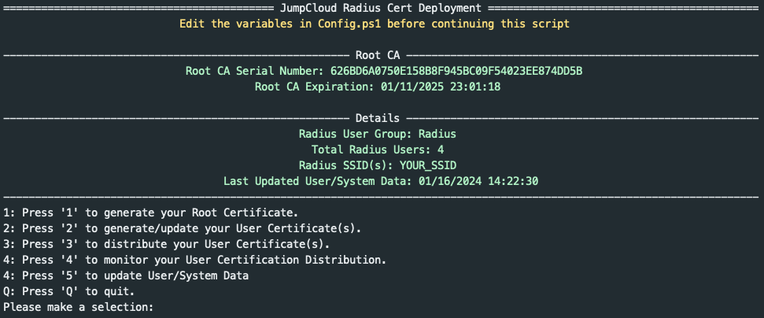

# Generate Radius Certificates for users

This set of PowerShell automations are designed to help administrators generate user certificates for [passwordless Radius Server Authentication](https://support.jumpcloud.com/support/s/article/configuring-radius-servers-in-jumpcloud1).

## Requirements

This automation has been tested with OpenSSL 3.0.7. OpenSSL 3.x.x is required to generate the Radius Authentication user certificates. The following items are required to use this automation workflow

- PowerShell 7.x.x ([PowerShell 7](https://learn.microsoft.com/en-us/powershell/scripting/install/installing-powershell?view=powershell-7.3))

- OpenSSL 3.x.x (Tested with 3.0.7) (see macOS/ Windows requirements below)
- [JumpCloud PowerShell Module](https://www.powershellgallery.com/packages/JumpCloud)
- Certificate Authority (CA) (either from a vendor or self-generated)
- Variables in `config.ps1` updated
  - JumpCloud API Key Set (Read/ Write Access Required)
  - JumpCloud ORG ID Set
  - JumpCloud User Group containing users and assigned to a Radius Server

### macOS Requirements

macOS ships with a version of OpenSSL titled LibreSSL. LibreSSL is sufficient to generate the `usernameCN` and `emailDN` type certificates but not the `emailSAN` type certificate (due to the inclusion of x509 subject headers in the certificate body). As such, a distribution of OpenSSL 3.x.x is required to run these scripts. While running the application, you'll be prompted to locate Openssl 3.x.x if it is not found.

To install the latest version of OpenSSL on mac, install the [Homebrew package manager](https://brew.sh/) and install the following [formulae](https://formulae.brew.sh/formula/openssl@3)

Some packages or applications in macOS rely on the pre-configured LibreSSL distribution. To use the Homebrew distribution of OpenSSL in this project, simply change the `$openSSLBinary` variable to point to the Homebrew bin location ex:

In `Config.ps1` change `$opensslBinary` to point to `'/usr/local/Cellar/openssl@3/3.0.7/bin/openssl'`

ex:

```powershell
$opensslBinary = '/usr/local/Cellar/openssl@3/3.0.7/bin/openssl'
```

### Windows Requirements

Windows does not typically ship with a preconfigured version of OpenSSL but a pre-compiled version of OpenSSL can be installed from [Shining Light Productions](https://slproweb.com/products/Win32OpenSSL.html). These automations have been tested with the full installer (i.e. not the "Light") version of the tool. OpenSSL can of course be downloaded and configured from [source](https://www.openssl.org/source) if desired.

If the pre-compiled version of OpenSSL was installed, the OpenSSL should be installed in `C:\Program Files\OpenSSL-Win64\bin\`. There should exist an `openssl.exe` binary in that directory. In addition, there should also exist a `legacy.dll` file in that same directory which is required if generating `$emailSAN` user certificates.

To set the required system environment variables for this automation

- Open Control Panel
- Select "Edit the system environment variables"
- under the "System Properties" window and "Advanced" tab, select the "Environment Variables..." box
- Under the "User Variables for yourAccount" Click the "New..." box
  - Set the Variable Name to: `OPENSSL_MODULES`
  - Set the Variable Value to: `C:\Program Files\OpenSSL-Win64\bin` or the location of the `legacy.dll` file included in your OpenSSL distribution
  - Click "OK"
- Under the "System variables" section scroll down to the "Path" variable, select it and click "Edit..."
  - Add a new line entry for this variable and type `C:\Program Files\OpenSSL-Win64\bin` or the location of the `openssl.exe` file included in your OpenSSL distribution
  - Click "OK"
- Click "OK" to close and save the Environment Variables dialog box
- Click "OK to close and save the System Properties dialog box

The `openssl` command should be available in new PowerShell terminal windows.

## Setup

Ensure that you are these commands in a PowerShell 7 environment. Within your PowerShell terminal window run `$PSVersionTable`, PSVersion should be version 7.x.x. If 5.1.x is running you need to install [PowerShell 7 from Microsoft](https://learn.microsoft.com/en-us/powershell/scripting/install/installing-powershell?view=powershell-7.3)

After installing PowerShell 7.x.x, install the [JumpCloud PowerShell Module](https://www.powershellgallery.com/packages/JumpCloud) in the PowerShell terminal window. This can be done by running `Install-Module -Name JumpCloud`

At the time of this writing JumpCloud Module 2.1.3 was the latest version. Please ensure you are at least running this version of the PowerShell Module.

### Set the Radius Config File

Before Running the `Start-RadiusDeployment.ps1` script, the environment variables for your JumpCloud Organization must first be set. Open the `config.ps1` file with a text editor.

#### Set Your API Key ID

Change the variable `$JCAPIKEY` to an [API Key](https://support.jumpcloud.com/s/article/jumpcloud-apis1) from an administrator in your JumpCloud Tenant. An administrator API Key with at least [read/write access](https://support.jumpcloud.com/support/s/article/JumpCloud-Roles) is required.

#### Set Your Organization ID

Change the variable `$JCORGID` to the [organization ID value](https://support.jumpcloud.com/s/article/Settings-in-the-JumpCloud-Admin-Portal#AccessOrgID) from your JumpCloud Tenant.

#### Set Your User Group ID

Change the variable `$JCUSERGROUP` to the ID of the JumpCloud user group with access to the Radius server. To get the ID of a user group, navigate to the user group within the JumpCloud Administrator Console.

After selecting the User Group, view the url for the user group it should look similar to this url:
`https://console.jumpcloud.com/#/groups/user/5f808a1bb544064831f7c9fb/details`

The ID of the selected userGroup is the 24 character string between `/user/` and `/details`: `5f808a1bb544064831f7c9fb`

#### Set the openSSL Binary location

Depending on the host system and how OpenSSL is installed, this variable can either point to a path or call the binary with just the name `openssl`.

[For macOS systems](#macos-requirements), this will likely need to be set to the openSSL binary installation path like `'/usr/local/Cellar/openssl@3/3.0.7/bin/openssl'` if installed through Homebrew.

Else, for Windows systems, installing OpenSSL and setting an environment variable described in [Windows Requirements](#Windows-Requirements) should be sufficient. (i.e no additional changes to `$opensslBinary` necessary)

#### Set Your Certificate Subject Headers

Change the default values provided in the `$Subj` variable to Country, State, Locality, Organization, Organization Unit and Common Name values for your organization. **Note: subject headers must not contain spaces**

#### Set Desired User Certificate Type

Change the `$certType` variable to either `EmailSAN`, `EmailDN` or `UsernameCn`

##### Email Subject Alternative Name (EmailSAN)

User certificates generated with this identification method will contain the JumpCloud user email within the subject alternative name header.

A generated EmailSAN certificate will embed the user's email within the subject alternative name X509 extension header:

When a EmailSAN user certificate authorizes to a JumpCloud managed radius network, the user's email will be recoded from the email subject alternative name metadata:


##### Email Distinguished Name (EmailDN)

User certificates generated with this identification method will contain the JumpCloud user email within the subject distinguished name.

A generated EmailDN certificate will embed the user's email within the certificate's subject distinguished name:

When a EmailDN user certificate authorizes to a JumpCloud managed radius network, the user's email will be recoded from the email address metadata:


##### Username Common Name (UsernameCN)

User certificates generated with this identification method will contain the JumpCloud username within the subject common name.

A generated UsernameCN certificate will embed the user's username within the certificate's subject common name:

When a UsernameCN user certificate authorizes to a JumpCloud managed radius network, the user's username will be recoded from the common name metadata.


## Certificate Generation

The entire certificate generate process is managed through a PowerShell menu based script `Start-RadiusDeployment.ps1`. To run the main program simply open a PowerShell 7 terminal session, cd to the location where this automation is stored and run:

```PowerShell
./Start-RadiusDeployment.ps1
```

An interactive menu will be presented displaying the following:


### Certificate Authority Generation or Import

A Certificate Authority (CA) is required for passwordless Radius Authentication. This file is to be uploaded to JumpCloud to serve as the Certificate Authority for subsequently generated user certificates.


#### Generating a self-signed certificate

The first option in the menu will present options to generate a self-signed CA. The resulting file `radius_ca_cert.pem` in the `projectDir/Radius/Cert` directory. When generating a self signed CA, a password prompt is displayed, this password is used to protect the CA from unauthorized access. Choose a secure but memorable password, during the session this password will be stored as an environment variable as it is required to generate user certificates.

#### Importing a certificate

To Import your own CA, the certificate and key files can be copied to the `projectDir/Radius/Cert` directory. **Note: Please ensure the certificate and key name ends with `key.pem` and `cert.pem` (ex. `radius_ca_cert.pem` or `radius_ca_key.pem`)**

After successful import or generation of a self signed CA, the CA's serial number and expiration date will be displayed on the main menu.


### User Cert Generation

With the certificate authority generated/ imported, individual user certs can then be generated. The ID of the user group stored as the variable: `$JCUSERGROUP` is used to store JumpCloud users destined for passwordless Radius access. For each user in the group, a `.pfx` certificate will be generated in the `/projectDir/Radius/UserCerts/` directory. The user certificates are stored locally and monitored for expiration.

If local user certificates are set to expire within 15 days, a notification is displayed on the main menu:


At any time user certificates can be manually removed from the `/projectDir/Radius/UserCerts/` directory and regenerated using option 2 from the main menu. User certificates can be continuously re-applied to devices using option 3 to distribute user certificates.

## Certificate Distribution

Option 3 in the main menu will enable admins to distribute user certificates to end user devices. Commands will be generated in your JumpCloud Tenant for each user in the Radius User Group and their corresponding system associations. This script will prompt you to kick off the generated commands. If the commands are invoked, they should be queued for all users in the Radius User Group. These commands are queued with a TTL timeout of 10 days — meaning that if the end user device is offline when the command is queued, for 10 days, the command will sit in the JumpCLoud console and wait for the device to come online before attempting to run.

On the device, certificates are replaced if a command is sent to a device with a newer certificate. i.e.


In this example, users Bob and Ali were connected to a radius network with their individual certificates. newly generated certificates are issued to Bob and Ali via generated JumpCloud Commands. Bob's new user certificate with serial number `XYZ1` would be installed and the older certificate with serial number `ABC1` would then be removed from the device. Ali's user certificate with serial number `HIJ2` would be installed and the older certificate with serial number `EFG1` would be removed from the device.

Replacement of user certificates can occur while a device is actively connected to the radius network protected by passwordless certificate based authentication due to the fact that authentication is session based. If Bob in this example authenticated to the radius network with cert serial number `ABC1` the network session between Bob and the radius network is instantiated. During that session, the certificate `ABC1` can be replaced with certificate `XYZ2` from Bob's computer without network interruption. Upon next authentication, the system should default to using the new certificate.

The generated JumpCloud commands for Bob will only remove certificate `ABC1` if `XYZ2` is installed successfully.

### Monitor Certificate Deployment Status

After creating the commands to distribute the certificates to users, you can view the overall progress of the deployment through option 4 in the main menu. This automation will query the deployment status of each generated command and display a table of the command status. If a command is no longer queued (Either through cancellation or the TTL timeout of 10 days exceeded) or if the command failed (either through some standard error or end user not being logged in (exit code 4)) these commands can be reissued using the menu options

After issuing commands to devices, the list of commands issued to devices can be viewed:


Individual failed commands can be explored with option 2 from the certificate deployment menu. In this example a different user other than the intended user was logged in at time of execution. If the failed commands are re-issued using option 3:


If the failed commands are re-issued using option 3:


After logging into the user account `Farmer_142` on `SE0PU00ABEXY-darwin` system and reissuing the command, the certificate is installed successfully:


### End User Experience

After a user's certificate has been distributed to a system, those users can then connect to a radius network with certificate based authentication.
### Importing a certificate

If you have your own self-signed certificate, you can import the certificate and key to `/projectDirectory/Radius/Cert/` folder. Note: Please make sure the certificate and key name ends with `key.pem` and `cert.pem` (ex. `radius_ca_cert.pem` or `radius_ca_key.pem`)

### Importing a certificate with a .pfx file

In order to import a certificate from a .pfx file, the certificate and key needs to be extracted from .pfx file.

1. Extract the private key: `openssl pkcs12 -in certfile.pfx -nocerts -out /projectDirectory/Radius/Cert/radius_ca_key.pem`
   * Replace certfile.pfx to the file path of your .pfx file. Make sure the `radius_ca_key.pem` is saved or moved to `/projectDirectory/Radius/Cert/` directory
   * This command will prompt for the .pfx password. NOTE: Please DO NOT FORGET the password as you will need it when generating user certificates.
2. Extract the certificate: `openssl pkcs12 -in certfile.pfx -nokeys -out /projectDirectory/Radius/Cert/radius_ca_cert.pem`
   *  Replace certfile.pfx to the file path of your .pfx file. Make sure the  `radius_ca_cert.pem` is saved or moved to `/projectDirectory/Radius/Cert/`  directory
   *  Again, this command will prompt for the .pfx password

NOTE: You will get prompted with the Key password Generating user certificates. The password will be saved as an Environment Variable.

### MacOS

In MacOS a user simply needs to select the radius network from the wireless networks dialog prompt. A prompt to select a user certificate should be displayed, select the user certificate from the drop down menu and click "OK"


The user is prompted to validate the certificate, click "Continue"


After validating the certificate, the user is prompted to enter their password to assign the Radius SSID to the selected certificate:


After entering the password, the user as asked again to sign using this certificate, enter the password and select "Always Allow"


After entering the password, the user as asked again to access using this certificate, enter the password and select "Always Allow"


The user should then be connected to the radius network.

### Windows

In Windows, select the radius network from the wireless networks dialog prompt, an option to select a certificate should be displayed. Select the certificate which corresponds with the user on the device. Select "OK":


Before Connecting, users can view the authentication source. Click "Connect" to connect to the network, no password is necessary.


The user should then be connected to the radius network.

### Troubleshooting

#### Clearing Commands Queue

If needed, you can clear out your entire commands queue. Copy and paste the following code to a PowerShell terminal window where you've already run `Connect-JCOnline`

```powershell
function Get-JCQueuedCommands {
    begin {
        $headers = @{
            "x-api-key" = $Env:JCApiKey
            "x-org-id"  = $Env:JCOrgId

        }
        $limit = [int]100
        $skip = [int]0
        $resultsArray = @()
    }
    process {
        while (($resultsArray.results).Count -ge $skip) {
            $response = Invoke-RestMethod -Uri "https://console.jumpcloud.com/api/v2/queuedcommand/workflows?limit=$limit&skip=$skip" -Method GET -Headers $headers
            $skip += $limit
            $resultsArray += $response.results
        }
    }
    end {
        return $resultsArray
    }
}
$headers = @{
    "x-api-key" = $Env:JCApiKey
    "x-org-id"  = $Env:JCOrgId
}
$queuedCommands = Get-JCQueuedCommands
foreach ($queue in $queuedCommands.id) {
    $response = Invoke-RestMethod -Uri "https://console.jumpcloud.com/api/v2/commandqueue/$($queue)" -Method DELETE -Headers $headers
}
```
