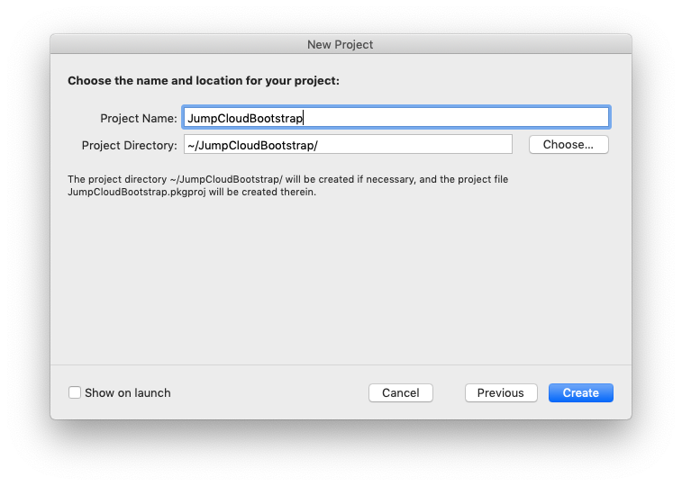
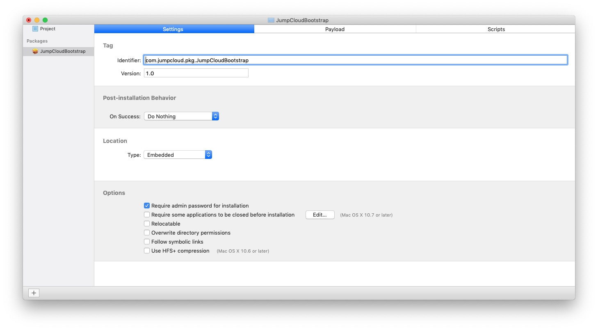
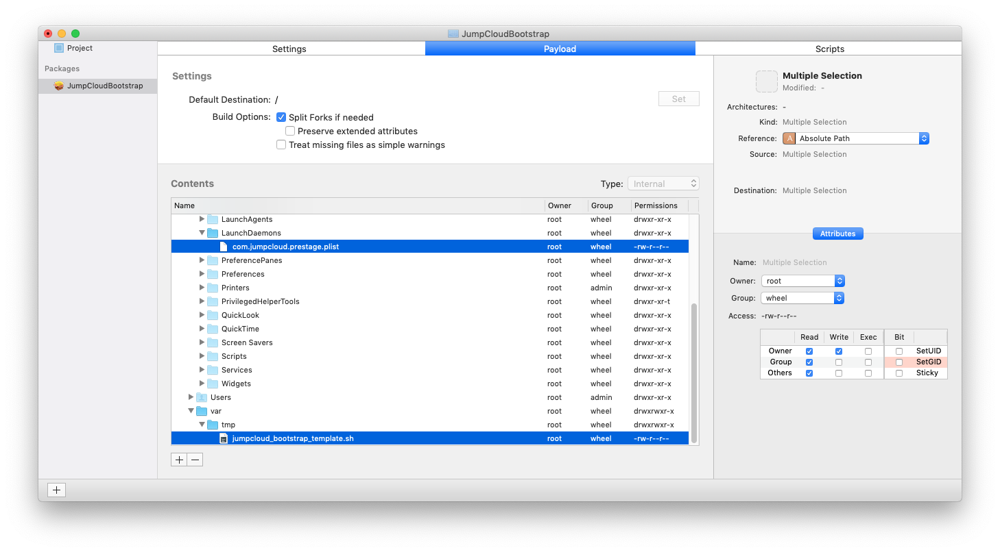
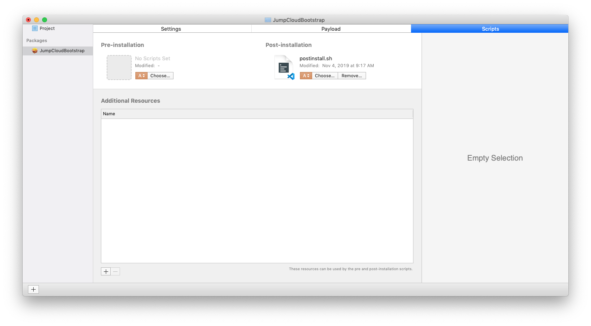
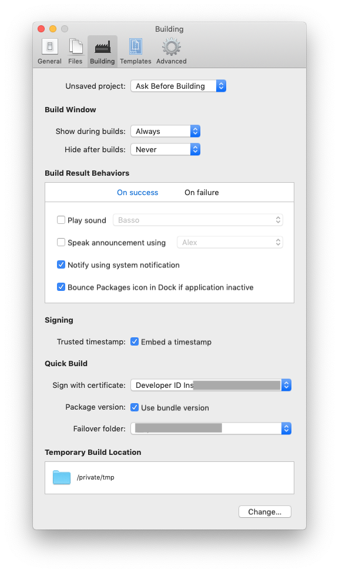
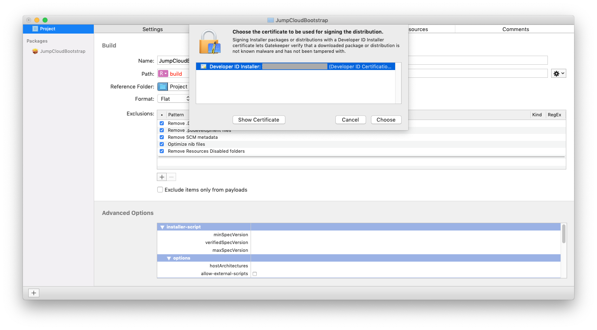

**Configuring a Zero-Touch macOS onboarding experience for PreStaging user and system enrollment using DEPNotify, WhiteBox Packages, JumpCloud, and your MDM of choice.**

Leveraging this workflow enables admins to install the JumpCloud agent silently and ensures that the JumpCloud Service Account is installed using DEP and an MDM.

The JumpCloud Service Account is required to manage users on FileVault enabled macs.

[Learn more about the JumpCloud Service Account here.](https://support.jumpcloud.com/customer/portal/articles/2944374)

*This example uses SimpleMDM*


**Table Of Contents**
- [Prerequisites](#prerequisites)
  - [An Apple Device Enrollment (DEP) Account](#an-apple-device-enrollment-dep-account)
  - [An MDM server integrated with Apple DEP](#an-mdm-server-integrated-with-apple-dep)
  - [An Apple Developer Account](#an-apple-developer-account)
  - [WhiteBox Packages or an alternative macOS PKG building tool or application](#whitebox-packages-or-an-alternative-macos-pkg-building-tool-or-application)
  - [Users who you wish to enroll using this zero-touch workflow added to the JumpCloud directory.](#users-who-you-wish-to-enroll-using-this-zero-touch-workflow-added-to-the-jumpcloud-directory)
- [Zero-Touch Enrollment Workflow Diagram](#zero-touch-enrollment-workflow-diagram)
- [Component Definitions](#component-definitions)
- [Configuration Steps](#configuration-steps)
  - [Step 1 - Clone or download the prestage_user_enrollment directory](#step-1---clone-or-download-the-prestageuserenrollment-directory)
  - [Step 2 - Open the JumpCloud Bootstrap template script](#step-2---open-the-jumpcloud-bootstrap-template-script)
  - [Step 3 - Configuring the JumpCloud Tenant For DEP Zero-Touch](#step-3---configuring-the-jumpcloud-tenant-for-dep-zero-touch)
  - [Step 4 - Populating the Bootstrap template script variables](#step-4---populating-the-bootstrap-template-script-variables)
    - [Variable Definitions](#variable-definitions)
  - [Step 5 - Selecting a User Experience](#step-5---selecting-a-user-experience)
    - [Example user experience without secret](#example-user-experience-without-secret)
    - [Example user experience with secret](#example-user-experience-with-secret)
  - [Step 6 - Create the LaunchDaemon](#step-6---create-the-launchdaemon)
  - [Step 7 - Create the postinstall script](#step-7---create-the-postinstall-script)
  - [Step 8 - Creaking a PKG using WhiteBox Packages](#step-8---creaking-a-pkg-using-whitebox-packages)
  - [Step 9 - Configuring MDM PreStage Settings](#step-9---configuring-mdm-prestage-settings)
  - [Step 10 - Configuring the PKG for MDM deployment](#step-10---configuring-the-pkg-for-mdm-deployment)
  - [Step 11 - Creating a Privacy Preference Policy](#step-11---creating-a-privacy-preference-policy)
- [Testing the workflow](#testing-the-workflow)

## Prerequisites

### An Apple Device Enrollment (DEP) Account

- The Apple DEP portal was initially launched as a stand alone console but now exists as a nested feature within Apple Business Manager
  - Need a DEP account? [Click here to sign up.](https://business.apple.com/#enrollment)

### An MDM server integrated with Apple DEP

To implement this zero-touch workflow a MDM server must be configured to deploy the MDM profiles and PKG payload to DEP enrolled machines.

- Jamf KB article: [Integrating with Apple's Device Enrollment (formerly DEP)](https://www.jamf.com/jamf-nation/articles/359/integrating-with-apple-s-device-enrollment-formerly-dep)
- Simple MDM KB article: [How to Enroll in MDM with Apple DEP](https://simplemdm.com/mdm-apple-dep-how-to/)

### An Apple Developer Account

An Apple Developer Account is required to sign the macOS package created in this workflow.

- Need a Apple Developer Account? [Click here to sign up.](https://developer.apple.com/programs/)
- A "Developer ID Installer" Certificate is required to sign packages. The Developer ID installer must be imported into Keychain Access to sign packages.

### [WhiteBox Packages](http://s.sudre.free.fr/Software/Packages/about.html) or an alternative macOS PKG building tool or application

The JumpCloud Bootstrap configuration script configured in this guide must be packaged **and** signed using an Apple Developer ID.

- [WhiteBox Packages](http://s.sudre.free.fr/Software/Packages/about.html) is an easy to use packaging application that is used in this workflow to built a deployable .pkg.
  - [Download WhiteBox Packages](http://s.sudre.free.fr/Software/Packages/about.html)  

### Users who you wish to enroll using this zero-touch workflow added to the JumpCloud directory.

- JumpCloud KB article: [Getting Started: Users](https://jumpcloud.desk.com/customer/en/portal/articles/2778996-getting-started-users)

## Zero-Touch Enrollment Workflow Diagram


## Component Definitions

**DEP:** The Apple Device Enrollment Program.

**MDM Server:** A Mobile Device Management server registered with Apple DEP.

**jumpcloud_bootstrap_template.sh:** The template .sh file that contains the logic for the zero-touch workflow. This file has variables that must be populated with org specific settings and has fields to populate with a user configuration module. This .sh file is converted to a PKG and is the payload which is run which drives the zero-touch workflow.

**LaunchDaemon:** A LaunchDaemon will be created to drive the completion of the jumpcloud_bootstrap_template.sh script. LaunchDaemons are processes which run as root and are invoked at system startup.

**Enrollment User:** The admin account pushed down via the MDM. Logging into this account is the first step in kicking off the zero-touch workflow. This account gets taken over and then inactivated on the system in the zero-touch workflow. Logging in with an Enrollment User is required to install the JumpCloud service account which manages SecureTokens and FileVault enabled users.

**JumpCloud Service Account:** The JumpCloud Service Account is created using the **Enrollment User** credentials. The JumpCloud Service Account is required to manage SecureTokens and FileVault enabled users. This users is created as a hidden user on macOS machines.

**JumpCloud Decryption User:** The UID of this account is used to encrypt the JumpCloud API key in tandem with the JumpCloud Org ID using the "EncryptKey()" function. This account gets pushed down to the account during zero-touch enrollment and the UID is used to decrypt the "$ENCRYPTED_KEY" variable.

**JumpCloud System Context API:** A method for authenticating to the JumpCloud API without an API key. A system can modify only it's direct associations using this authentication method. [Learn more here.](https://docs.jumpcloud.com/2.0/authentication-and-authorization/system-context)

**JumpCloud DEP Enrollment User Group:** A JumpCloud user group which contains two members, the **Enrollment User** account and the **JumpCloud Decryption User** account. This user group is bound to the **JumpCloud DEP Enrollment System Group**.

**JumpCloud DEP Enrollment System Group:** The JumpCloud system group that a system adds itself to using System Context API authentication. When a system adds itself to the DEP Enrollment System group the **Enrollment User** account is taken over and converted to a standard user from an admin user and the **JumpCloud Decryption User** is bound to the machine. The zero-touch workflow removes the system from this group after DEP enrollment which deactivates both the **Enrollment User** and the **JumpCloud Decryption User** accounts.

**JumpCloud DEP POST Enrollment User Group:** A JumpCloud user group which contains one member the **Default Admin** account. This user group is bound to the **JumpCloud DEP POST Enrollment System Group**.

**JumpCloud DEP POST Enrollment System Group:** The JumpCloud  system group that a system adds itself to add the end of DEP enrollment. When a system adds itself to the DEP POST Enrollment System Group the **Default Admin** account is bound to the system.

**JumpCloud Bootstrap PKG:** The product archive package created from a configured jumpcloud_bootstrap_template.sh file using WhiteBox Packages or an alternative macOS PKG building tool.

**DEPNotify:** The application that drives the UI of the zero-touch workflow.

**JumpCloud Agent:** The JumpCloud Agent gets installed after the Enrollment User signs in. This agent is what manages local accounts on macOS machines and creates the JumpCloud Service Account.

**JumpCloud API:** The JumpCloud API is used in the **jumpcloud_bootstrap_template.sh** to drive the zero-touch workflow.

**Password Configuration Window:** A osascript that presents users with an input box to set a secure password with regex validation. A Privacy Preferences MDM Profile must be created to suppress the security pop-up.

**PreStaged JumpCloud Users:** Pending JumpCloud users configured with access to JumpCloud resources who activate their accounts using the zero-touch workflow.

## Configuration Steps


This guide uses [WhiteBox Packages](http://s.sudre.free.fr/Software/Packages/about.html) to build the custom PKG. The instructions in this guide can be used with alternative PKG creation tools.

### Step 1 - Clone or download the prestage_user_enrollment directory

After installing [WhiteBox Packages](http://s.sudre.free.fr/Software/Packages/about.html) download the contents of [this project directory](https://github.com/TheJumpCloud/support/tree/master/zero-touch/prestage_user_enrollment). If using [GitHub Desktop](https://desktop.github.com/), simply clone the entire [support repository](https://github.com/TheJumpCloud/support/tree/master/) to GitHub Desktop and navigate to the prestage_user_enrollment directory to view the contents.

### Step 2 - Open the JumpCloud Bootstrap template script

Open the [jumpcloud_bootstrap_template.sh file](./jumpcloud_bootstrap_template.sh) in your code editor of choice.

The JumpCloud Solution Architecture team loves to work with SH files in the code editor Visual Studio Code.

- Want to try VS Code? [Click here to download](https://code.visualstudio.com/)

### Step 3 - Configuring the JumpCloud Tenant For DEP Zero-Touch

**Configure JumpCloud Settings**


To configure a JumpCloud tenant for zero-touch DEP integration you will first need to enable the setting for `Enable UID/GID management for users` in the JumpCloud "Settings"->"General" pane.

Enabling this setting is required to properly configure the **Decryption User**.

The UID if this user is used to create the the **ENCRYPTED_KEY** variable.

**Configure JumpCloud Users**

- Enrollment User

The enrollment user account will have the same displayName and username as the first account pushed down to your system via your MDM.

Create an enrollment user account and set the password for this account to be exactly the same as the settings configured in [Step 9](#Step-9---Configuring-MDM-PreStage-Settings)

Example:


This account is taken over during DEP enrollment and then disabled on the machine after DEP enrollment completes.

- Decryption User

The UID of the decryption user account will be used to populate the "ENCRYPTED_KEY=''" variable in [Step 4](#Step-4---Populating-the-Bootstrap-template-script-variables). Create a JumpCloud account and set a secure password for this account.

Under this users "User Security Settings and Permissions" check the box for "Enable as Admin/Sudo on all system associations" and "Enforce UID/GID consistency for all systems" and enter in a numerical "Unix UID" and "Unix GID" value over 7 characters.

Take note of the value populated for the "Unix UID" as this will be used in [Step 4](#Step-4---Populating-the-Bootstrap-template-script-variables) to create the "ENCRYPTED_KEY=''" variable.

Example:


- Default Admin (Optional)

This account will be used in this workflow to bind a default admin account to each DEP enrolled system when the system is added to the DEP Post Enrollment System Group. If you already have a default admin account in your JumpCloud tenant you can simply use this account.

For this user ensure that the box "Enable as Admin/Sudo on all system associations" under this users "User Security Settings and Permissions" is checked.

Example:


**Configure JumpCloud Groups**

- DEP Enrollment User Group

Create a JumpCloud User Group named "DEP Enrollment User Group" under the "Users" settings for this group add two users: the **Enrollment User** and the **Decryption User**.

Example:


- DEP Enrollment System Group

Create a JumpCloud System Group named "DEP Enrollment System Group" under the "User Groups" settings for this group add the group "DEP Enrollment User Group"

Example:


After creating the group take note of the "DEP  Enrollment System Group" JumpCloud ID value.

To find the JumpCloud ID value for a JumpCloud system group navigate to the "GROUPS" section of the JumpCloud admin portal and select the system group to bring up the system group details. Within the URL of the selected command the systemGroupID will be the 24 character string between 'system/' and '/details'. The JumpCloud PowerShell command Get-JCGroup can also be used to find the systemGroupID. The systemGroupID is the 'id' value which will be displayed for each JumpCloud group when Get-JCGroup is called.

Example:


- DEP Post Enrollment User Group

Create a JumpCloud User Group named "DEP Post Enrollment User Group" under the "Users" settings for this group add one user: **Default Admin**.


- DEP Post Enrollment System Group

Create a JumpCloud System Group named "DEP Post Enrollment System Group" under the "User Groups" settings for this group add the group "DEP Post Enrollment User Group"


After creating the group take note of the "DEP Post Enrollment System Group" JumpCloud ID value.

To find the JumpCloud ID value for a JumpCloud system group navigate to the "GROUPS" section of the JumpCloud admin portal and select the system group to bring up the system group details. Within the URL of the selected command the systemGroupID will be the 24 character string between 'system/' and '/details'. The JumpCloud PowerShell command Get-JCGroup can also be used to find the systemGroupID. The systemGroupID is the 'id' value which will be displayed for each JumpCloud group when Get-JCGroup is called.

Example:


### Step 4 - Populating the Bootstrap template script variables

Within the "General Settings" near the top of the  `jumpcloud_bootstrap_template.sh` file you will find the input section for org specific variables.

Example:

```SH
################################################################################
# General Settings - POPULATE THE BELOW VARIABLES                              #
################################################################################

### Bind user as admin or standard user ###
# Admin user: admin='true'
# Standard user: admin='false'
admin='false'

### Minimum password length ###
minlength=8

### JumpCloud Connect Key ###
YOUR_CONNECT_KEY=''

### Encrypted API Key ###
## Use below SCRIPT FUNCTION: EncryptKey to encrypt key
ENCRYPTED_KEY=''

### Username of the JumpCloud user whose UID is used for decryption ###
DECRYPT_USER=''

### JumpCloud System Group ID For DEP Enrollment ###
DEP_ENROLLMENT_GROUP_ID=''

### JumpCloud System Group ID For DEP POST Enrollment ###
DEP_POST_ENROLLMENT_GROUP_ID=''

### DEPNotify Welcome Window Title ###
WELCOME_TITLE=""

### DEPNotify Welcome Window Text use \n for line breaks ###
WELCOME_TEXT=''

### Boolean to delete the enrollment user set through MDM ###
DELETE_ENROLLMENT_USERS=true

### Username of the enrollment user account configured in the MDM.
### This account will be deleted if the above boolean is set to true.
ENROLLMENT_USER=""

### NTP server, set to time.apple.com by default, Ensure time is correct ###
NTP_SERVER="time.apple.com"

### Daemon Variable
daemon="com.jumpcloud.prestage.plist"

### User self identification parameter
# Update the self_ID variable with one of the below options to change the default option (Company Email)
# Company Email (default): self_ID="CE"
# lastname: self_ID="LN"
# personal email: self_ID="PE"
# NOTE for "personal email" the JumpCloud user field "description" is used
self_ID="CE"

### Include secret id (employee ID) ###
# Default setting is false
# Set to true to add "secret word" to user self identification screen
# This is recommended if "active" JumpCloud users will be enrolled
# NOTE for "secret word" the JumpCloud user field "employeeID" is used
# Ex: DELETE_ENROLLMENT_USERS=true
self_secret=false

### Password Update Settings ###
# This setting defines if active users will be forced to update their passwords
# Pending users will always be required to set a password during enrollment
# Default setting is false
# Update the self_ID self_passwd to modify this setting
# Ex: self_passwd=true
self_passwd=false

#~~~~~~~~~~~~~~~~~~~~~~~~~~~~~~~~~~~~~~~~~~~~~~~~~~~~~~~~~~~~~~~~~~~~~~~~~~~~~~~
# END General Settings                                                         ~
#~~~~~~~~~~~~~~~~~~~~~~~~~~~~~~~~~~~~~~~~~~~~~~~~~~~~~~~~~~~~~~~~~~~~~~~~~~~~~~~
```

#### Variable Definitions

- `admin='false'`

This variable defines how users will be created through the zero-touch workflow. There are two possible values `admin='false'` (default) creates the user as a standard user. `admin='true'` creates users as admin users.

- `minlength=8`

This variable defines the minimum password length that a user can set during enrollment. Set this to match your JumpCloud password complexity settings.

- `YOUR_CONNECT_KEY=''`

Enter the connect key from your JumpCloud tenant. This can be found within the "Systems" tab by clicking the green plus and selecting Windows or Mac.

- `ENCRYPTED_KEY=''`

The `EncryptKey()` function must be used to create the **ENCRYPTED_KEY** variable.

```SH
function EncryptKey() {
    # Usage: EncryptKey "API_KEY" "DECRYPT_USER_UID" "ORG_ID"
    local ENCRYPTION_KEY=${2}${3}
    local ENCRYPTED_KEY=$(echo "${1}" | openssl enc -e -base64 -A -aes-128-ctr -nopad -nosalt -k ${ENCRYPTION_KEY})
    echo "Encrypted key: ${ENCRYPTED_KEY}"
}
```

Three parameters are used to create this encrypted string.

1. JumpCloud API key

   - Need help finding your JumpCloud API key? See KB:[Obtaining Your API Key](https://support.jumpcloud.com/customer/en/portal/articles/2429680-jumpcloud-apis#configuration)

2. UID of **Decryption User** created in [Step 3](#step-3---configuring-the-jumpcloud-tenant-for-dep-zero-touch)

   - To find the UID of the **Decryption User** expand the "User Security Settings and Permissions" and find this value under "Unix UID"


3. JumpCloud Organization ID

   - The JumpCloud Organization ID can be found under the "Settings"-> "General" pane in the JumpCloud admin console.


Use the `EncryptKey()` function to generate the **ENCRYPTED_KEY** variable using these three parameters.

Usage: EncryptKey "API_KEY" "DECRYPT_USER_UID" "ORG_ID"

Example:

```SH
function EncryptKey() {
    # Usage: EncryptKey "API_KEY" "DECRYPT_USER_UID" "ORG_ID"
    local ENCRYPTION_KEY=${2}${3}
    local ENCRYPTED_KEY=$(echo "${1}" | openssl enc -e -base64 -A -aes-128-ctr -nopad -nosalt -k ${ENCRYPTION_KEY})
    echo "Encrypted key: ${ENCRYPTED_KEY}"
}

EncryptKey c57c341a4a38f132019770f1689bbe7530bdfef3 8675309 59664bf31254e1cc14e82117

Encrypted key: 43H/pQGRJ5Uut5R3wagbPSS/I2cATai4dUCnqsimkFQ6OvqnFerp9l8=
```

The `DecryptKey()` function can be used to validate that the encryption worked correctly.

Usage: DecryptKey "ENCRYPTED_KEY" "DECRYPT_USER_UID" "ORG_ID"

 Example:

```SH
function DecryptKey() {
    # Usage: DecryptKey "ENCRYPTED_KEY" "DECRYPT_USER_UID" "ORG_ID"
    echo "${1}" | openssl enc -d -base64 -aes-128-ctr -nopad -A -nosalt -k "${2}${3}"
}

DecryptKey 43H/pQGRJ5Uut5R3wagbPSS/I2cATai4dUCnqsimkFQ6OvqnFerp9l8= 8675309 59664bf31254e1cc14e82117

c57c341a4a38f132019770f1689bbe7530bdfef3
```

- `DECRYPT_USER=''`

Enter the username (case sensitive) of the **Decryption User** created in [Step 3](#step-3---configuring-the-jumpcloud-tenant-for-dep-zero-touch)

- `DEP_ENROLLMENT_GROUP_ID=''`

Enter the JumpCloud ID value of the **DEP Enrollment System Group**

- `DEP_POST_ENROLLMENT_GROUP_ID=''`

Enter the JumpCloud ID value of the **DEP Post Enrollment System Group**

- `WELCOME_TITLE=""`

Enter a welcome title that will launch when DEPNotify launches.

- `WELCOME_TEXT=''`

Enter welcome text that will load when DEPNotify launches.

Use \n for line breaks.

- `DELETE_ENROLLMENT_USERS=true`

A Boolean variable that by default is set to true. This variable controls if the `DECRYPT_USER` and `ENROLLMENT_USER` accounts are deleted from the system at the end of the flow. It is recommend to leave this variable set to True to ensure that these users are removed.

- `ENROLLMENT_USER=""`

The username of the MDM enrollment user pushed down to the machine.

Example of populated variables:

```SH
################################################################################
# General Settings - POPULATE THE BELOW VARIABLES                              #
################################################################################

### Bind user as admin or standard user ###
# Admin user: admin='true'
# Standard user: admin='false'
admin='false'

### Minimum password length ###
minlength=8

### JumpCloud Connect Key ###
YOUR_CONNECT_KEY='b5a0d92cfe32096feb67e30528a5facd72fb4529'

### Encrypted API Key ###
## Use below SCRIPT FUNCTION: EncryptKey to encrypt key 503 UID used
ENCRYPTED_KEY='43H/pQGRJ5Uut5R3wagbPSS/I2cATai4dUCnqsimkFQ6OvqnFerp9l8='

### Username of the JumpCloud user whose UID is used for decryption ###
DECRYPT_USER='it.service'

### JumpCloud System Group ID For DEP Enrollment ###
DEP_ENROLLMENT_GROUP_ID='5d0a48cc1f247527b2f92266'

### JumpCloud System Group ID For DEP POST Enrollment ###
DEP_POST_ENROLLMENT_GROUP_ID='5d0a48fz45886d39c9dba975'

### DEPNotify Welcome Window Title ###
WELCOME_TITLE="Welcome to Azzipa.\n Where we make backwards pizzas."

### DEPNotify Welcome Window Text use \n for line breaks ###
WELCOME_TEXT='Sit back and relax as your computer configures itself for you. \n\n After configuration settings download you will be asked to activate your account and set a password!'

### Boolean to delete the enrollment user set through MDM ###
DELETE_ENROLLMENT_USERS=true

### Username of the enrollment user account configured in the MDM.
### This account will be deleted if the above boolean is set to true.
ENROLLMENT_USER="Welcome"

### NTP server, set to time.apple.com by default, Ensure time is correct ###
NTP_SERVER="time.apple.com"

### Daemon Variable
daemon="com.jumpcloud.prestage.plist"

### User self identification parameter
# Update the self_ID variable with one of the below options to change the default option (Company Email)
# Company Email (default): self_ID="CE"
# lastname: self_ID="LN"
# personal email: self_ID="PE"
# NOTE for "personal email" the JumpCloud user field "description" is used
self_ID="CE"

### Include secret id (employee ID) ###
# Default setting is false
# Set to true to add "secret word" to user self identification screen
# This is recommended if "active" JumpCloud users will be enrolled
# NOTE for "secret word" the JumpCloud user field "employeeID" is used
# Ex: DELETE_ENROLLMENT_USERS=true
self_secret=false

### Password Update Settings ###
# This setting defines if active users will be forced to update their passwords
# Pending users will always be required to set a password during enrollment
# Default setting is false
# Update the self_ID self_passwd to modify this setting
# Ex: self_passwd=true
self_passwd=false

#~~~~~~~~~~~~~~~~~~~~~~~~~~~~~~~~~~~~~~~~~~~~~~~~~~~~~~~~~~~~~~~~~~~~~~~~~~~~~~~
# END General Settings                                                         ~
#~~~~~~~~~~~~~~~~~~~~~~~~~~~~~~~~~~~~~~~~~~~~~~~~~~~~~~~~~~~~~~~~~~~~~~~~~~~~~~~
```

### Step 5 - Selecting a User Experience

As of release 3.0 the existing user_configuration_modules are built into the jumpcloud_bootstrap_template.sh script. Instead of copying and pasting values, an admin can configure the user experience by setting the three variables at the end of the "General Settings" code block.

The three variables below are used to drive the user experience to their configured values.

```bash
self_ID="CE"
self_secret=false
self_passwd=false
```

The `self_ID` variable may be set to:

`self_ID="CE"` to prompt users to enter their company email (default setting)

`self_ID="PE"` to prompt users to enter their personal email

`self_ID="LN"` to prompt users to enter their last name

The `self_secret` variable may be set to either `true` or `false`. If this variable is set to true, users will be prompted to enter a secret id during the enrollment workflow. If set to false, users will **not** be prompted to enter a secret id.

The `self_secret` variable dictates the user experience for active JumpCloud users. if set to `true`, existing users with JumpCloud passwords will be prompted to create a new password during the enrollment workflow. The default setting will not prompt existing JumpCloud users to enter a new password. Pending users without passwords in JumpCloud are always prompted to enter a password during the enrollment process.

By default the values are set to accept a user's company email address. Pending users will always be prompted to enter a password for their new account. Configuring the variables above give optionality for how users will activate their JumpCloud accounts through the DEPNotify registration window.

#### Example user experience without secret

The image below displays the default user experience, a user is prompted to enter their company email. The field referenced on the JumpCloud console is a user's email field. If a user enters an email of an existing or pending JumpCloud user the DEPNotify window will allow that user to authenticate as that user.

A self_ID variable set to "CE" and self_secret variable set to false should present the user with the following window during enrollment.


A self_ID variable set to "PE" and self_secret variable set to false should present the user with the following window during enrollment.


There is no defined field for "personal email" in JumpCloud so the "description" field is used to lookup and locate a user by personal email. The "Description" field for users must be populated with a value for this workflow to succeed.

#### Example user experience with secret

The image below displays another user experience, a user is prompted for their company email and a secret word. The input fields "Company Email" is used to query the "EMAIL" attribute for existing JumpCloud users. The input field "Secret" is used to query the "employeeIdentifier" attribute. The "employeeIdentifier" field for users must be populated with a value for this workflow to succeed. The "employeeIdentifier" attribute is required to be unique per user. This user experience can be used to activate **Pending** or **Active** JumpCloud users.

Pending users are users who have not set a password. Active users are users who have already set a password. A "secret" is required for these workflows. This "secret" is a value that is populated for the JumpCloud "employeeIdentifier" field of the user by the admin and provided to employees prior to zero-touch DEP enrollment. The secret secures the enrollment and provides an additional factor of verification to activate or update the JumpCloud account.

The default configuration will prompt pending users to enter a new password, active users are not required to set a password.


The user experience can be modified to accept a personal email address. The input fields "Personal Email" is used to query the "Description" attribute for existing JumpCloud users. The input field "Secret" is used to query the "employeeIdentifier" attribute. The "employeeIdentifier" field for users must be populated with a value for this workflow to succeed. The "employeeIdentifier" attribute is required to be unique per user.


Alternatively the input fields "Last Name" can used to query the "lastname" attribute for existing JumpCloud users. The input field "Secret" is used to query the "employeeIdentifier" attribute. The "employeeIdentifier" field for users must be populated with a value for this workflow to succeed. The "employeeIdentifier" attribute is required to be unique per user.


### Step 6 - Create the LaunchDaemon

In order to ensure the JumpCloud user account is configured during this process. A LaunchDaemon will control the execution of the jumpcloud_bootstrap_template.sh script. For additional information, [Apple's documentation archive](https://developer.apple.com/library/archive/documentation/MacOSX/Conceptual/BPSystemStartup/Chapters/Introduction.html) is a expansive resource for building and designing daemons. This workflow requires a daemon to run the jumpcloud_bootstrap_template.sh script on startup.

1. Create a .plist file or copy the provided [com.jumpcloud.prestage.plist](./com.jumpcloud.prestage.plist) daemon file.

2. Ensure the Label Key and string aligns with the variable name set in the jumpcloud_prestage_template.sh file. The .plist file will be loaded as a LaunchDaemon at the end of the postinstall script created in the next step.
     - The provided [com.jumpcloud.prestage.plist](./com.jumpcloud.prestage.plist) daemon is set to run at system load, start the `jumpcloud_bootstrap_template.sh` script and will restart every 10 seconds if the script exits early.

3. Check that the .plist is formatted correctly using the below command:

`plutil -convert xml1 ExampleBinary.plist`

*Running this command and receiving no return code validates that the plist file is formatted correctly.*

Example:

```bash
bash-3.2$ ls
com.jumpcloud.prestage.plist	jumpcloud_bootstrap_template.sh
bash-3.2$ plutil -convert xml1 com.jumpcloud.prestage.plist 
bash-3.2$ 
```

Optionally include reporting keys for additional debugging:

```xml
<key>StandardErrorPath</key>
<string>/var/tmp/com.jumpcloud.prestage.err</string>
<key>StandardOutPath</key>
<string>/var/tmp/com.jumpcloud.prestage.out</string>
```

### Step 7 - Create the postinstall script

In the postinstall script add in the following payload. The LaunchDaemon must be moved to a system's /Library/LaunchDaemons/ directory in the postinstall script.

```sh
#!/bin/sh

# set the LaunchDaemon variable with the name of the LaunchDaemon
daemon="com.jumpcloud.prestage.plist"

# Enter the ENROLLMENT_USER within the '' of ENROLLMENT_USER=''
ENROLLMENT_USER=''

# Enter the ENROLLMENT_USER_PASSWORD within the '' of ENROLLMENT_USER_PASSWORD='' with the credentials of the admin with a secure token
ENROLLMENT_USER_PASSWORD=''

cat <<-EOF >/var/run/JumpCloud-SecureToken-Creds.txt
$ENROLLMENT_USER;$ENROLLMENT_USER_PASSWORD
EOF

# Move LaunchDaemon to /Library/LaunchDaemons/
if [[ ! -f "/Library/LaunchDaemons/${daemon}" ]]; then
  mv "/var/tmp/${daemon}" "/Library/LaunchDaemons/"
fi

# Set Permissions
chmod 744 /var/tmp/jumpcloud_bootstrap_template.sh
chown root:wheel /var/tmp/jumpcloud_bootstrap_template.sh
chmod 644 "/Library/LaunchDaemons/${daemon}"
chown root:wheel "/Library/LaunchDaemons/${daemon}"

# load the LaunchDaemon
launchctl load -w "/Library/LaunchDaemons/${daemon}"

```

Populate the `ENROLLMENT_USER=''` and the `ENROLLMENT_USER_PASSWORD=''` with the values specified for this account in [Step 3](#step-3---configuring-the-jumpcloud-tenant-for-dep-zero-touch)

Example:

```sh
#!/bin/sh

# set the LaunchDaemon variable with the name of the LaunchDaemon
daemon="com.jumpcloud.prestage.plist"

# Enter the ENROLLMENT_USER within the '' of ENROLLMENT_USER=''
ENROLLMENT_USER='Welcome'

# Enter the ENROLLMENT_USER_PASSWORD within the '' of ENROLLMENT_USER_PASSWORD='' with the credentials of the admin with a secure token
ENROLLMENT_USER_PASSWORD='Welcome1!'

cat <<-EOF >/var/run/JumpCloud-SecureToken-Creds.txt
$ENROLLMENT_USER;$ENROLLMENT_USER_PASSWORD
EOF

# Move LaunchDaemon
if [[ ! -f "/Library/LaunchDaemons/${daemon}" ]]; then
  mv "/var/tmp/${daemon}" "/Library/LaunchDaemons/"
fi

# Set Permissions
chmod 744 /var/tmp/jumpcloud_bootstrap_template.sh
chown root:wheel /var/tmp/jumpcloud_bootstrap_template.sh
chmod 644 "/Library/LaunchDaemons/${daemon}"
chown root:wheel "/Library/LaunchDaemons/${daemon}"

# load the LaunchDaemon
launchctl load -w "/Library/LaunchDaemons/${daemon}"

```

The presences of the `JumpCloud-SecureToken-Creds.txt` file is require to install the JumpCloud agent with the JumpCloud Service Account. The JumpCloud Service Account is mandatory to manage Secure Tokens and Filevault enabled users. The `JumpCloud-SecureToken-Creds.txt` is deleted by the agent install process and removed from the system.

### Step 8 - Creaking a PKG using [WhiteBox Packages](http://s.sudre.free.fr/Software/Packages/about.html)

The following steps are used to create and sign the deployment .pkg file. The files referenced above will be added to the package project.

Open WhiteBox Packages to create a new project folder. Create a distribution style project.


Name, optionally change the directory and create the project



Click the package name in the left column and optionally change the default identifier and version number.



Within the Payload tab, copy the modified com.jumpcloud.prestage.plist daemon into the LaunchDaemons directory. Copy the jumpcloud_bootstrap_template.sh file into /var/tmp/. To create the /var/ and /tmp/ directories, click the root "/" directory and select "new folder". The payload should look similar to the example below:



Within the scripts tab, drag the modified postinstall.sh file into the Post-installation script field box.



Open Preferences and select the building tab.



Click the project title in the left column and select the menu option Project > Set Certificate



Build the project under the Build menu > Build.


Need packaging help? See: [WhiteBox Packages documentation](http://s.sudre.free.fr/Software/documentation/Packages/en_2017/index.html)

Need signing help? See [Package signing](https://developer.apple.com/developer-id/)

### Step 9 - Configuring MDM PreStage Settings

- User Settings

In the MDM DEP Apple PreStage settings configure the MDM to not prompt the user to create an account by setting the value of "Prompt user to create" to **"No Account"**.

- Enrollment User

In the MDM DEP Apple PreStage settings enable the MDM to "Automatically create an administrator account" and specify the `Short name` of the username and the `Full name` of the first and last name of the **Enrollment User** configured in [Step 3](#step-3---configuring-the-jumpcloud-tenant-for-dep-zero-touch). Ensure that the password set for this account is also the same password specified for the **Enrollment User** account configured in [Step 3](#step-3---configuring-the-jumpcloud-tenant-for-dep-zero-touch)

Example:


### Step 10 - Configuring the PKG for MDM deployment

- Uploading PKG

Upload the PKG to the MDM


- PKG Settings

Ensure the PKG is configured for "Device Level Installation". By setting the PKG to "Device Level Installation" the PKG will install as soon as a device enrolls into MDM.


- PKG Scoping

Scope the PKG to auto deploy to the machines you wish to configure for zero-touch configuration.

### Step 11 - Creating a Privacy Preference Policy

Create the below "Privacy Preference" profile. This will allow the osascript to run which prompts users to input a secure password. Or download the [JAMF profile](./tcc-bash.mobileconfig) if deploying over JAMF Pro.

**Identifier type:** path

**Identifier:**/bin/bash

**Code requirement:** identifier "com.apple.bash" and anchor apple

**Static code validation:** No

Apple Event Targets

**Identifier Type:** bundle ID

**Identifier:** com.apple.systemevents

**Code Requirement:** identifier "com.apple.systemevents" and anchor apple

**Access:** Allow


## Testing the workflow

This article from SimpleMDM gives a great tutorial for how to setup a DEP sandbox environment to test out the macOS zero-touch deployment workflow using virtual machines VMWare Fusion, Parallels, or VirtualBox.

[Test Apple DEP with VMware, Parallels, and VirtualBox](https://simplemdm.com/2018/04/03/apple-dep-vmware-parallels-virtualbox/)